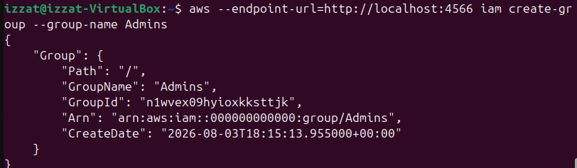
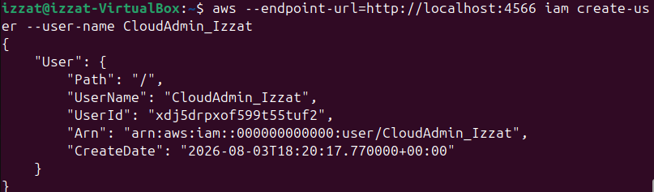
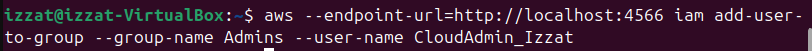
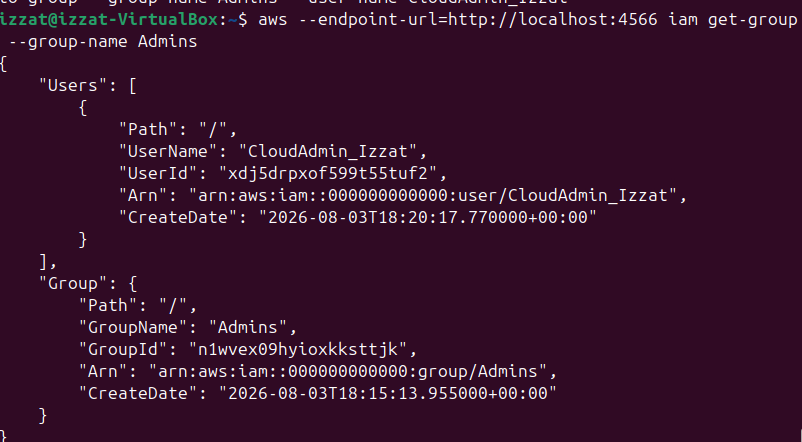
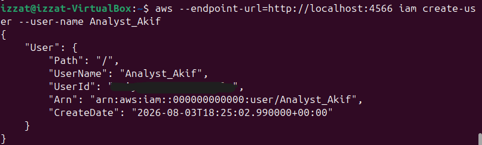
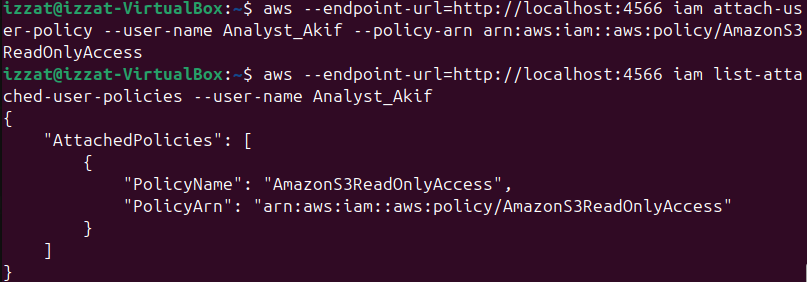
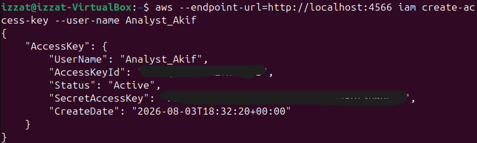
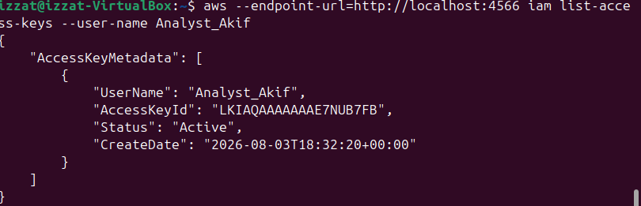
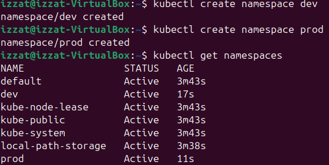

# Lab 1: Cloud Account Security, Identity and Access Management

**Course:** IKB42603 Cloud Computing Security Essentials  
<br> **Lab:** Lab1_Account_Security_and_IAM  
**Environment:** LocalStack on `localhost:4566` and kind Kubernetes cluster `ccse-lab1`
<br> **Name:** Muhamad Izzat A'kif Bin Mohd Sanusi
<br> **ID:** 52215124688
<br> **Date:** 4 August 2026

## Lab Summary // Objective

This lab demonstrated account security and access control using two local platforms:

- **LocalStack IAM** was used to simulate AWS IAM users, groups, policies and access keys.
- **Kubernetes RBAC** was used to enforce real authorization decisions using roles and role bindings.

## Evidence Folder

All screenshots used for this report are stored in the `Evidence` folder.

| Evidence File | Purpose |
|---|---|
| `Task2.1.png` | Commands for creating the admin group, attaching policy, creating admin user and verifying membership |
| `Task2.1.png` | `Admins` group creation output |
| `Task2.2.png` | `CloudAdmin_Izzat` admin user creation output |
| `Task2.3.png` | `CloudAdmin_izzat` membership in `Admins` group |
| `Task2.4.png` | `Analyst_Akif` read-only user creation output |
| `Task3.1.png` | `AmazonS3ReadOnlyAccess` attached to `Analyst_Akif` |
| `Task3.3.png` | Access key creation for `Analyst_Akif` |
| `Task4.1.png` | Access key listing for `Analyst_Akif` |
| `Task4.2.png` | Access key rotation command showing deactivation |
| `SetupTask B.png` | kind Kubernetes cluster setup |
| `Task5.png` | `dev` and `prod` namespace creation |
| `Task6.png` | Service account, Role and RoleBinding creation |
| `Task7.png` | RBAC authorization test results |
| `RBAC Verification.png` | RoleBinding YAML verification |

## Task 1: Map the Cloud Identity Landscape

| Concept | AWS Term | Purpose |
|---|---|---|
| All-powerful owner | Root user | The original account owner with full control over all resources and billing. It should be protected and not used for daily administration. |
| Human/app identity | IAM User | A named identity for a person, application or service that needs credentials to access cloud resources. |
| Permission bundle | IAM Policy | A JSON permission document that defines which actions are allowed or denied on specific resources. |
| Collection of users | IAM Group | A way to manage permissions for multiple users together by attaching policies to the group. |
| Temporary identity | IAM Role | An identity that can be assumed temporarily to grant short-lived permissions without long-term user credentials. |

## Session A: LocalStack IAM

### Environment Setup

The AWS CLI was pointed to LocalStack using:

```bash
EP='--endpoint-url=http://localhost:4566'
```

This means AWS CLI commands were sent to the local LocalStack endpoint instead of real AWS.

Verification command:

```bash
aws --endpoint-url=http://localhost:4566 sts get-caller-identity
```
```

The account ID `000000000000` confirms the commands were executed against LocalStack.

## Task 2: Create a Least-Privilege Admin

### Step 2.1: Create Admins Group

Command:

```bash
aws $EP iam create-group --group-name Admins
```

Result:

The group `Admins` was created successfully.

Evidence:



### Step 2.2: Attach Administrator Policy to Group

Command:

```bash
aws $EP iam attach-group-policy --group-name Admins \
    --policy-arn arn:aws:iam::aws:policy/AdministratorAccess
```

Verification command:

```bash
aws $EP iam list-attached-group-policies --group-name Admins
```
```

This proves that the `AdministratorAccess` policy was attached to the `Admins` group.

```bash
```

Evidence:



### Step 2.3: Create Personal Admin User

Command:

```bash
aws $EP iam create-user --user-name CloudAdmin_dani
```

Result:

The user `CloudAdmin_dani` was created successfully.

Evidence:



### Step 2.4: Add User to Admins Group and Verify Membership

Command:

```bash
aws $EP iam add-user-to-group --group-name Admins \
    --user-name CloudAdmin_dani
```

Verification command:

```bash
aws $EP iam get-group --group-name Admins
```

Evidence:



## Task 3: Enforce Least Privilege with a Scoped Policy

### Step 3.1: Create Read-Only Analyst User

Command:

```bash
aws $EP iam create-user --user-name Analyst_Akif
```

Result:

The user `Analyst_Akif` was created successfully.

Evidence:



### Step 3.2: Attach S3 Read-Only Policy

Command:

```bash
aws $EP iam attach-user-policy --user-name Analyst_Akif \
    --policy-arn arn:aws:iam::aws:policy/AmazonS3ReadOnlyAccess
```

### Step 3.3: Verify Analyst Permissions

Verification command:

```bash
aws $EP iam list-attached-user-policies --user-name Analyst_Akif
```

Output:

```json
{
    "AttachedPolicies": [
        {
            "PolicyName": "AmazonS3ReadOnlyAccess",
            "PolicyArn": "arn:aws:iam::aws:policy/AmazonS3ReadOnlyAccess"
        }
    ]
}
```

This proves that `Analyst_Akif` only has the `AmazonS3ReadOnlyAccess` policy attached.

Evidence:



### Least Privilege Explanation

- If the `Analyst_Akif` account were stolen, the damage would be limited because the account only has read-only S3 permissions. 
- The attacker would not have administrator privileges and should not be able to create users, delete resources, change IAM policies or modify data. 
- This reduces the blast radius because the compromised identity can only perform the limited actions granted by its scoped policy.

## Task 4: Credential Hygiene and Access Keys

### Step 4.1: Create Access Key

Command:

```bash
aws $EP iam create-access-key --user-name Analyst_Akif
```

Result:

An access key was created for `Analyst_Akif`.

Evidence:



Security note: the secret access key is not repeated in this report. In real cloud environments, access keys must not be committed to repositories, shared in screenshots or stored in plaintext.

### Step 4.2: List Access Keys

Command:

```bash
aws $EP iam list-access-keys --user-name Analyst_Akif
```

Output:

```json
{
    "AccessKeyMetadata": [
        {
            "UserName": "Analyst_Akif",
            "AccessKeyId": "LKIAQAAAAAAANMJV6XA3",
            "Status": "Inactive",
            "CreateDate": "2026-07-29T05:29:06.789002+00:00"
        }
    ]
}
```

Evidence:



### Step 4.3: Rotate and Deactivate Old Key

Command:

```bash
aws $EP iam update-access-key --user-name Analyst_jiha \
    --access-key-id LKIAQAAAAAAANMJV6XA3 --status Inactive
```

Result:

The access key status is now `Inactive`, which demonstrates key rotation/deactivation.

## Session B: Kubernetes RBAC

### Setup: Create Local Kubernetes Cluster

Command:

```bash
kind create cluster --name ccse-lab1
kubectl cluster-info --context kind-ccse-lab1
kubectl get nodes
```

Result:

The local kind cluster `ccse-lab1` was created and kubectl was configured to use context `kind-ccse-lab1`.

Evidence:


## Task 5: Separate Environments with Namespaces

Commands:

```bash
kubectl create namespace dev
kubectl create namespace prod
kubectl get namespaces
```

Result:

The namespaces `dev` and `prod` were created and listed as `Active`.

Evidence:



## Task 6: Define a Role and Bind It

### Step 6.1: Create Service Account

Command:

```bash
kubectl create serviceaccount dev-user -n dev
```

Result:

The service account `dev-user` was created in the `dev` namespace.

### Step 6.2: Create Pod Reader Role

Command:

```bash
kubectl create role pod-reader -n dev \
    --verb=get,list,watch --resource=pods
```

Result:

The Role `pod-reader` was created in the `dev` namespace. It allows only `get`, `list` and `watch` actions on pods.

### Step 6.3: Create RoleBinding

Command:

```bash
kubectl create rolebinding dev-user-binding -n dev \
    --role=pod-reader --serviceaccount=dev:dev-user
```

Result:

The RoleBinding `dev-user-binding` binds the `pod-reader` Role to the `dev-user` service account.

Evidence:


## Task 7: Test Access Control

The service account identity was stored in a shell variable:

```bash
SA=system:serviceaccount:dev:dev-user
```

This represents the Kubernetes service account `dev-user` in the `dev` namespace.

### Test 1: List Pods in Dev

Command:

```bash
kubectl auth can-i list pods -n dev --as=$SA
```

Result:

```text
yes
```

Explanation:

The service account can list pods in `dev` because the `pod-reader` Role allows `list` on pods in the `dev` namespace.

### Test 2: Delete Pods in Dev

Command:

```bash
kubectl auth can-i delete pods -n dev --as=$SA
```

Result:

```text
no
```

Explanation:

The service account cannot delete pods because the Role only grants `get`, `list` and `watch`. Delete permission was not granted.

### Test 3: List Pods in Prod

Command:

```bash
kubectl auth can-i list pods -n prod --as=$SA
```

Result:

```text
no
```

Explanation:

The service account cannot list pods in `prod` because the Role and RoleBinding are namespaced to `dev`. The permission does not extend to the `prod` namespace.

Evidence:


### Authentication vs Authorization

The service account identity passes authentication because Kubernetes recognizes the identity `system:serviceaccount:dev:dev-user`. The actions are then checked by authorization. Listing pods in `dev` is allowed because the RoleBinding grants that permission. Deleting pods in `dev` and listing pods in `prod` are blocked by authorization because those permissions were never granted.

## RBAC Verification Command

Required verification command:

```bash
kubectl get rolebinding dev-user-binding -n dev -o yaml
```

Output:

```yaml
apiVersion: rbac.authorization.k8s.io/v1
kind: RoleBinding
metadata:
  creationTimestamp: "2026-07-29T05:48:38Z"
  name: dev-user-binding
  namespace: dev
  resourceVersion: "701"
  uid: 91124053-fdc5-418a-a916-ec078374971c
roleRef:
  apiGroup: rbac.authorization.k8s.io
  kind: Role
  name: pod-reader
subjects:
- kind: ServiceAccount
  name: dev-user
  namespace: dev
```

Evidence:


This confirms that the `dev-user-binding` RoleBinding connects the `dev-user` service account to the `pod-reader` Role in the `dev` namespace.

## Short-Answer Questions

### Q1. Why is attaching policies to groups better than attaching them directly to users?

Keeping track of each user's permissions quickly becomes complicated. Instead, you may adjust permissions in a single location by attaching rules to groups. When someone departs or changes jobs, you just shift them to a different group, and everyone who is joined to the group automatically receives what they need. With access privileges, it saves a lot of time, maintains cleanliness, and avoids careless copy-paste errors.

### Q2. What is the difference between an IAM User and an IAM Role?

With long-term credentials like passwords or access keys, an IAM User is a permanent identity that is typically associated with a particular person or application. In contrast, an IAM Role is an identity that any authorised user or service can temporarily "assume" in order to obtain temporary security credentials. Because you aren't leaving long-term access keys out there that could be compromised, roles are far safer.

### Q3. Explain least privilege using the Analyst account, and how it reduces blast radius if compromised.

Giving someone the bare minimum of access necessary to perform their job is known as "least privilege." Because it only has read-only access to S3 (AmazonS3ReadOnlyAccess), the Analyst_jiha account is an excellent illustration. The "blast radius" (the potential damage) is little if a hacker manages to obtain such credentials because they can only access files. They are unable to alter administrative settings, build up costly instances, or remove buckets.

### Q4. In Kubernetes, what is the difference between a Role and a RoleBinding?

Consider a RoleBinding as the handshake and a Role as the set of rules.
What can be done, such as reading pods inside a particular namespace, is defined by the role (pod-reader).
By associating that role with an identity (such as the dev-user service account), the RoleBinding (dev-user-binding) determines who is allowed to accomplish it.

### Q5. Why did the developer service account fail to access prod, and which security principle does that demonstrate?

Because there was no Role or RoleBinding configured for it in production, its access privileges were rigidly restricted to the dev namespace, which is why it failed. This illustrates environment isolation and least privilege. A developer shouldn't have access to production just because they need authorisation to experiment in development.

## Security Best-Practices Checklist

- [x] Root user is not used for daily tasks because a dedicated admin identity, `CloudAdmin_Izzat`, exists.
- [x] Permissions are granted through the `Admins` group instead of attaching administrator permissions directly to the admin user.
- [x] A least-privilege read-only identity, `Analyst_Akif`, was created and assigned `AmazonS3ReadOnlyAccess`.
- [x] Access keys were created, listed and deactivated to demonstrate rotation.
- [x] Kubernetes RBAC blocked unauthorized actions: deleting pods in `dev` and listing pods in `prod`.

## Conclusion

Everything went according to plan: the RBAC rules performed as intended and the type cluster remained healthy. Pods could be listed in dev, but they couldn't be deleted or viewed in prod. In essence, authorisation examined the Role and RoleBinding to determine its actual capabilities, whereas authentication demonstrated the identity of the service account. It's a good, practical illustration of least privilege across namespaces.
