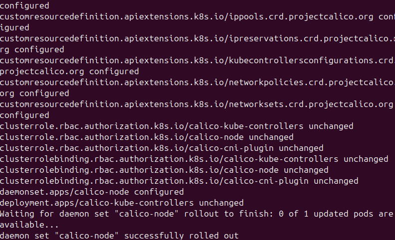
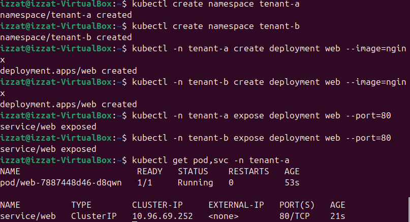
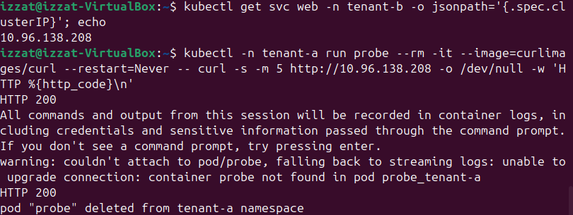
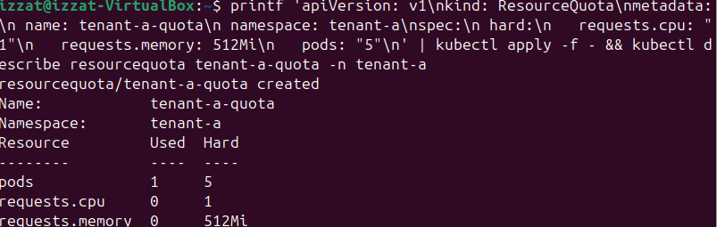
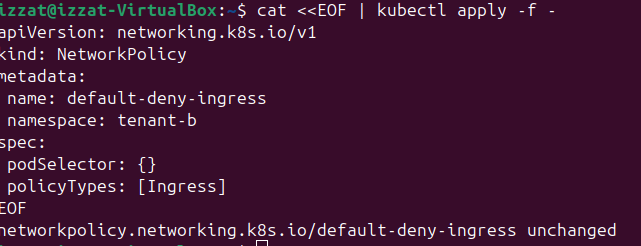
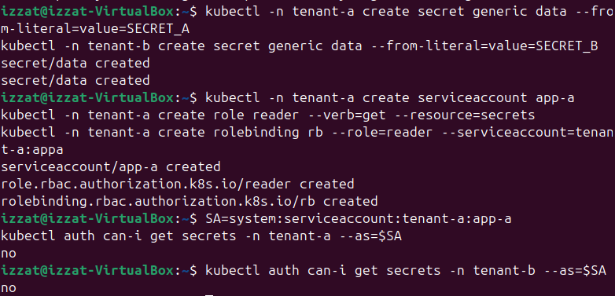
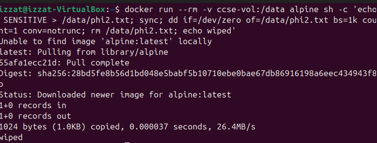
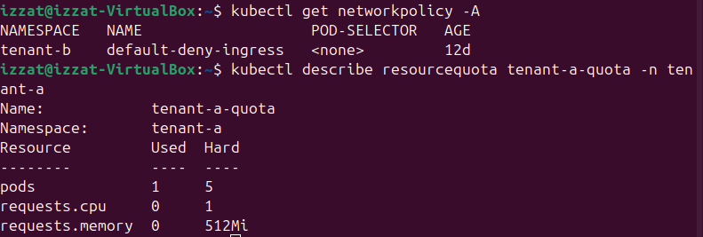
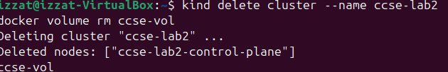

# Lab 2: Secure Isolation and Multi-Tenancy

**Course:** IKB42603 Cloud Computing Security Essentials  
**Lab:** Weeks 3–4 — Secure Isolation & Multi-Tenancy  
**Environment:** Docker, kind, Kubernetes, kubectl, Calico  
**Name:** Muhamad Izzat A'kif Bin Mohd Sanusi
**ID:** 52215124688
**Evidence date:** 29 August 2026

## Objectives

This lab demonstrates tenant isolation across three security dimensions:

1. **Compute isolation** using containers, Kubernetes namespaces, and a resource quota.
2. **Network isolation** using a Calico-enforced default-deny `NetworkPolicy`.
3. **Storage and secret isolation** using namespace-scoped RBAC.
4. **Secure deletion awareness** through normal deletion, overwriting, and the cloud concept of cryptographic erasure.

## Setup — Kubernetes Cluster with Calico

### Step 1: Create the kind cluster

The cluster was created with the default CNI disabled and the pod network set to `192.168.0.0/16`:

```yaml
kind: Cluster
apiVersion: kind.x-k8s.io/v1alpha4
networking:
  disableDefaultCNI: true
  podSubnet: 192.168.0.0/16
```

The terminal reported that the cluster `ccse-lab2` was created and the kubectl context was set to `kind-ccse-lab2`.


### Step 2: Install and verify Calico

Calico v3.27.0 was applied. Its resources were created, and the `calico-node` daemon set successfully rolled out. `kubectl get nodes` showed the control-plane node in `Ready` state.



**Result:** The Kubernetes environment was ready with a CNI capable of enforcing network policies.

## Task 1 — Two Tenants on One Cluster

### Procedure

1. Created namespaces `tenant-a` and `tenant-b`.
2. Created an Nginx deployment named `web` in each namespace.
3. Exposed each deployment as a port 80 `ClusterIP` service.
4. Waited for both deployments to complete their rollout.
5. Listed the pods and services in both namespaces.

```bash
kubectl create namespace tenant-a
kubectl create namespace tenant-b
kubectl -n tenant-a create deployment web --image=nginx
kubectl -n tenant-b create deployment web --image=nginx
kubectl -n tenant-a expose deployment web --port=80
kubectl -n tenant-b expose deployment web --port=80
kubectl get pods,svc -n tenant-a
kubectl get pods,svc -n tenant-b
```



**Observation:** Each tenant had its own running pod and service. Both tenants shared the same Kubernetes cluster but were logically organized into different namespaces.

**Security interpretation:** Namespaces separate names and administrative scope, but they do not by themselves create a network security boundary.

## Task 2 — Observe the Default-Open Risk

### Procedure

1. Retrieved the `tenant-b` web service's internal cluster address.
2. Launched a temporary curl probe from `tenant-a`.
3. Sent an HTTP request to the `tenant-b` service before applying a network policy.

```bash
B_IP=$(kubectl get svc web -n tenant-b -o jsonpath='{.spec.clusterIP}')
kubectl -n tenant-a run probe --rm -it --image=curlimages/curl --restart=Never -- \
  curl -s -m 5 "http://${B_IP}" -o /dev/null -w 'HTTP %{http_code}\n'
```



**Observed result:** `HTTP 200` was returned. The repeated `HTTP 200` in the evidence came from fallback log streaming after kubectl could not attach to the short-lived container; it represents the same successful probe, not a separate security test.

**Security interpretation:** Tenant A could reach Tenant B because Kubernetes networking is normally open between pods unless isolation policies select and restrict them. This proves that namespace separation alone did not prevent cross-tenant traffic.

## Task 3 — Contain the Noisy Neighbour

### Procedure

A resource quota was applied to `tenant-a`:

```yaml
apiVersion: v1
kind: ResourceQuota
metadata:
  name: tenant-a-quota
  namespace: tenant-a
spec:
  hard:
    requests.cpu: "1"
    requests.memory: 512Mi
    pods: "5"
```

The quota was then inspected using:

```bash
kubectl describe resourcequota tenant-a-quota -n tenant-a
```



**Observed result:** The quota limited Tenant A to five pods, one CPU of requested capacity, and 512 MiB of requested memory. At verification time, one pod was counted; CPU and memory requests showed zero because the deployed pod did not declare resource requests.

**Security interpretation:** The quota limits how much shared compute capacity Tenant A can reserve or consume through counted objects, reducing noisy-neighbour and resource-exhaustion risk. In production, workloads should also define container requests and limits so CPU and memory controls are effective and predictable.

## Task 4 — Default-Deny Network Isolation

### Procedure

1. Applied an ingress policy selecting every pod in `tenant-b`.
2. Included no ingress allow rules, thereby denying all ingress to the selected pods.
3. Confirmed the policy existed.
4. Repeated the same cross-tenant probe used in Task 2.

```yaml
apiVersion: networking.k8s.io/v1
kind: NetworkPolicy
metadata:
  name: default-deny-ingress
  namespace: tenant-b
spec:
  podSelector: {}
  policyTypes:
    - Ingress
```



The first attempt to retrieve logs failed because the original `--rm` probe from Task 2 had already been deleted. A persistent test pod was therefore created and its output inspected.

**Observed result:** The post-policy probe returned `HTTP 000`, and the pod ended in `Error`. For curl, code `000` means that no HTTP response was received; together with the five-second timeout and the before-policy `HTTP 200`, this is evidence that the request was blocked.

**Security interpretation:** The policy changes Tenant B from default-open to default-deny for inbound traffic. The evidence does not show a same-namespace allow policy, so this implementation blocks all ingress to Tenant B, including legitimate Tenant B pod-to-pod traffic, until explicit allow rules are added.

## Task 5 — Storage and Secret Isolation

### Procedure

1. Created a secret named `data` in each tenant namespace using distinct sample values.
2. Created service account `app-a` in `tenant-a`.
3. Created a namespace-scoped Role allowing `get` on secrets.
4. Bound that Role to `tenant-a:app-a`.
5. Used Kubernetes authorization checks to test access in both namespaces.

Sanitized equivalent commands:

```bash
kubectl -n tenant-a create secret generic data --from-literal=value='[REDACTED]'
kubectl -n tenant-b create secret generic data --from-literal=value='[REDACTED]'
kubectl -n tenant-a create serviceaccount app-a
kubectl -n tenant-a create role reader --verb=get --resource=secrets
kubectl -n tenant-a create rolebinding rb --role=reader \
  --serviceaccount=tenant-a:app-a

SA=system:serviceaccount:tenant-a:app-a
kubectl auth can-i get secrets -n tenant-a --as="$SA"
kubectl auth can-i get secrets -n tenant-b --as="$SA"
```



**Observed result:** The authorization result was `yes` for Tenant A and `no` for Tenant B.

**Security interpretation:** The RoleBinding grants access only inside `tenant-a`. The service account can read secrets in its own namespace but cannot cross the namespace boundary to read Tenant B's secret. The test verifies authorization isolation; it does not expose or decode either secret value.

## Task 6 — Data Remanence and Secure Deletion

### Procedure and observations

1. Created a sample sensitive file in Docker volume `ccse-vol`.
2. Deleted the file normally and searched visible files for the marker.
3. The command printed `scan-done` and did not display the marker.
4. Created a second sample file, overwrote its allocated content with 1 KiB of zeros using `dd`, and deleted it.
5. The terminal reported `1024 bytes` written and `wiped`.
6. Listed the volume; no files remained visible.

Sanitized command form:

```bash
docker run --rm -v ccse-vol:/data alpine sh -c \
  'echo [REDACTED] > /data/phi.txt; sync; rm /data/phi.txt; \
   grep -a [REDACTED] /data/* 2>/dev/null; echo scan-done'

docker run --rm -v ccse-vol:/data alpine sh -c \
  'echo [REDACTED] > /data/phi2.txt; sync; \
   dd if=/dev/zero of=/data/phi2.txt bs=1k count=1 conv=notrunc; \
   rm /data/phi2.txt; echo wiped'
```



**Security interpretation:** An ordinary delete removes the filesystem reference but may leave recoverable bytes in underlying storage. The visible-file `grep` used here cannot inspect unallocated blocks, so the absence of a match does not prove that remanent data was absent. Overwriting before deletion is stronger on simple local media, but copy-on-write filesystems, snapshots, SSD wear levelling, replicas, and provider-managed storage may retain other copies. Cloud systems therefore prefer cryptographic erasure: encrypt the data and securely destroy the encryption key.

## Verification

The final commands were:

```bash
kubectl get networkpolicy -A
kubectl describe resourcequota tenant-a-quota -n tenant-a
```



**Verified state:** `tenant-b` contained `default-deny-ingress`. The `tenant-a-quota` limits remained five pods, one requested CPU, and 512 MiB requested memory.

## Short-Answer Questions

### Q1. Why can containers in different namespaces reach each other by default, and why is that dangerous in a multi-tenant cloud?

Why it happens: Kubernetes namespaces provide logical separation for object naming and RBAC scoping, but by default, the Kubernetes flat network model allows unhindered Pod-to-Pod IP connectivity across all namespaces.

Why it is dangerous: In a multi-tenant environment sharing the same cluster infrastructure, an attacker who compromises a single container in tenant-a can freely probe, map, and exploit internal APIs, services, or unauthenticated endpoints belonging to tenant-b (lateral movement).

### Q2. Explain the default-deny principle and how the NetworkPolicy implements it.

Default-Deny Principle: A security baseline stating that all traffic, connections, or actions are implicitly blocked unless an explicit rule specifically permits them (zero-trust approach).

Implementation: The NetworkPolicy targets all pods within the namespace (podSelector: {}) and declares ingress in its policyTypes without defining any allowing rules under ingress. This drops all incoming network traffic from other namespaces or outside sources by default.

### Q3. How do virtual machines and containers differ in isolation strength? When would you add a VM boundary?

Isolation Difference:

Containers share the host system's OS kernel and use kernel features (namespaces, cgroups) for logical boundaries. A kernel vulnerability (privilege escalation/container escape) can compromise the host and all adjacent containers.

Virtual Machines (VMs) run independent operating systems on virtualized hardware managed by a hypervisor (Hardware-assisted isolation), providing a much stronger security boundary.

When to add a VM boundary: You should introduce a VM boundary when running untrusted user code, multi-tenant workloads with strict regulatory compliance constraints (e.g., PCI-DSS, HIPAA), or untrusted third-party applications where kernel-level isolation is insufficient.

### Q4. What is data remanence, and why is cryptographic erasure the preferred cloud solution?

Data Remanence: The residual representation of sensitive data that remains on physical storage media even after standard deletion commands (rm, format) have been executed.

Why Cryptographic Erasure is Preferred in Cloud: In public cloud environments, tenants do not have direct physical access to underlying storage drives to perform bit-level overwriting (like dd or physical destruction), and cloud storage relies on dynamic block abstraction/wear-leveling. Cryptographic erasure encrypts data by default and securely destroys the decryption keys, rendering the residual ciphertext permanently unreadable without needing physical drive access.

### Q5. Which isolation dimension did each task exercise?

| Task | Primary isolation dimension | Evidence or control |
|---|---|---|
| Task 1 | Compute / logical tenancy | Separate namespaces and deployments on one cluster |
| Task 2 | Network | Demonstrated default-open cross-namespace access |
| Task 3 | Compute / resource | ResourceQuota constrained Tenant A's shared capacity |
| Task 4 | Network | Default-deny ingress blocked cross-tenant traffic |
| Task 5 | Storage / secrets | Namespace-scoped RBAC allowed own-tenant and denied cross-tenant secret access |
| Task 6 | Storage / data lifecycle | Normal deletion, overwrite-before-delete, and remanence analysis |

## Security Best-Practices Checklist

- [x] Tenants were separated into distinct namespaces.
- [x] Default-open cross-tenant traffic was demonstrated with `HTTP 200`.
- [x] A default-deny NetworkPolicy blocked cross-tenant traffic, verified by `HTTP 000` after the policy.
- [x] A resource quota limited Tenant A's shared compute allocation.
- [x] Namespace-scoped RBAC denied Tenant A access to Tenant B's secrets.
- [x] Normal deletion and overwrite-before-delete were demonstrated.
- [x] The limits of local overwriting and the role of cryptographic erasure were explained.
- [ ] An explicit same-namespace allow policy was not shown in the supplied evidence and should be added if Tenant B requires internal ingress.

## Cleanup

After preserving the required evidence, the lab environment can be removed with:

```bash
kind delete cluster --name ccse-lab2
docker volume rm ccse-vol
```


Cleanup was not evidenced and is therefore not claimed as completed in this report.

## Conclusion

The lab showed that logical namespace separation alone does not make a shared Kubernetes cluster secure: Tenant A initially reached Tenant B successfully. A Calico-enforced default-deny policy blocked that path, a resource quota reduced noisy-neighbour risk, and namespace-scoped RBAC prevented cross-tenant secret access. The deletion exercise also showed why visible-file checks are not proof of physical erasure and why cloud systems favor encryption with controlled key destruction.
