# IKB42603 Cloud Computing Security Essentials

## Lab 4: Access Control and Network Security

**Student name:** Muhamad Izzat A'kif Bin Mohd Sanusi<br>
**Student ID:** 52215124688<br>
**Lab:** Lab 4 — Access Control and Network Security (Week 4)<br>
**Report date:** 3 September 2026

> **Privacy note:** Passwords, the TOTP shared secret, and all one-time codes have been replaced with redaction markers in commands, outputs, and report images. The report uses only the redacted evidence copies in `lab-images/lab4/`.

## Lab objectives

This lab demonstrates how to:

1. Distinguish authentication (AuthN) from authorization (AuthZ).
2. validate a time-based one-time password as a second authentication factor.
3. enforce least-privilege access with Kubernetes role-based access control (RBAC).
4. segment a three-tier application so the frontend cannot contact the database directly.
5. apply a default-deny firewall policy.
6. reduce a container's attack surface and scan an image for known vulnerabilities.

## Task 1 — Password-protected service

### Objective

Run an Nginx service protected by HTTP Basic authentication and confirm that an unauthenticated request is rejected while a request with valid credentials is accepted.

### Procedure

1. A bcrypt password entry was generated for the `student` user. The password is not reproduced in this report.

   ```bash
   docker run --rm httpd:alpine \
     htpasswd -nbB student '<REDACTED_PASSWORD>' > htpasswd.txt
   ```

2. `default.conf` was configured to protect the page using the mounted password file.

   ```nginx
   server {
       listen 80;
       server_name _;

       location / {
           auth_basic "Restricted";
           auth_basic_user_file /etc/nginx/.htpasswd;
           root /usr/share/nginx/html;
           index index.html;
       }
   }
   ```

3. The endpoint was tested without credentials and then with valid credentials.

   ```bash
   curl -s -o /dev/null \
     -w 'no-creds: %{http_code}\n' \
     http://localhost:8080

   curl -s -o /dev/null \
     -w 'valid-creds: %{http_code}\n' \
     -u student:'<REDACTED_PASSWORD>' \
     http://localhost:8080

   curl -s -u student:'<REDACTED_PASSWORD>' http://localhost:8080
   ```

The `401 Unauthorized` result shows that the service rejected a request with no credentials. The `200 OK` result and response body show that authentication succeeded when valid credentials were supplied.

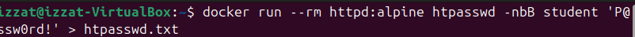

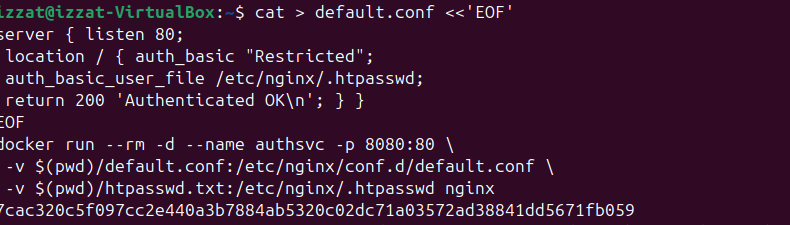

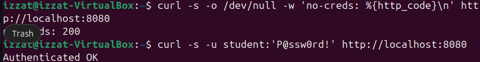

## Task 2 — Multi-factor authentication with TOTP

### Objective

Generate and validate a six-digit time-based one-time password (TOTP) as a second authentication factor.

### Procedure

1. A random Base32 shared secret was generated. Its value is redacted.

   ```bash
   SECRET=$(head -c 20 /dev/urandom | base32 | tr -d '\n')
   echo "Enrol this secret in an authenticator app: <REDACTED_TOTP_SECRET>"
   oathtool --totp -b "$SECRET"
   ```

The required successful `MFA OK` result is present. The earlier failed attempt does not invalidate the task; it demonstrates that a wrong or expired TOTP is rejected.

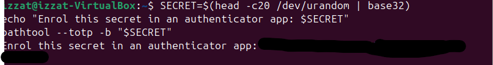

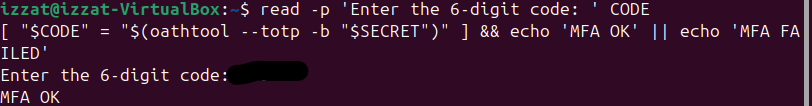

## Task 3 — Kubernetes authorization with RBAC

### Objective

Create a service account whose permissions are limited to reading pods, then verify that write and delete actions are denied.

### Procedure

1. A kind cluster named `ccse-lab4` was created and allowed to reach the `Ready` state.

   ```bash
   kind create cluster --name ccse-lab4
   kubectl cluster-info
   kubectl get nodes
   ```

2. The application namespace and developer service account were created.

   ```bash
   kubectl create namespace app
   kubectl create serviceaccount dev -n app
   ```

3. A namespaced role permitting only `get` and `list` on pods was created and bound to the service account.

   ```bash
   kubectl create role dev-role \
     -n app \
     --verb=get,list \
     --resource=pods

   kubectl create rolebinding dev-rb \
     -n app \
     --role=dev-role \
     --serviceaccount=app:dev
   ```

4. Kubernetes authorization checks were performed while impersonating the service account.

   ```bash
   SA=system:serviceaccount:app:dev
   kubectl auth can-i list pods -n app --as="$SA"
   kubectl auth can-i create deployments -n app --as="$SA"
   kubectl auth can-i delete pods -n app --as="$SA"
   ```

### Result

| Authorization test | Result | Interpretation |
|---|---:|---|
| List pods | `yes` | Allowed by `dev-role` |
| Create deployments | `no` | Not granted |
| Delete pods | `no` | Not granted |

The results demonstrate least privilege: the developer identity can inspect pods but cannot create deployments or delete pods.

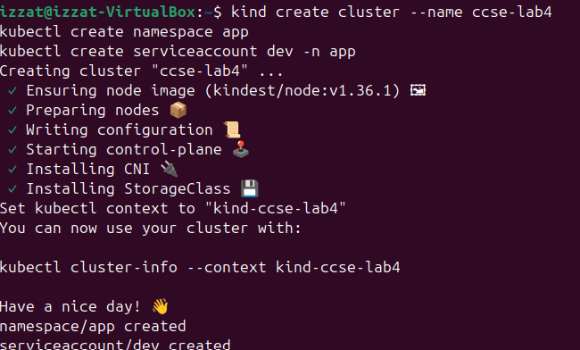

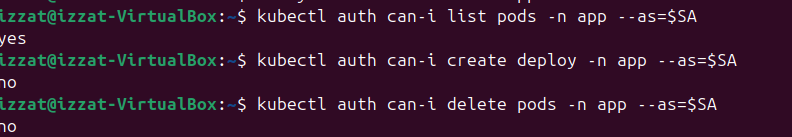

## Task 4 — Three-tier network segmentation

### Objective

Place the database, application, and web tiers on separate Docker networks so that only the application tier can reach the database.

### Procedure

1. Two isolated bridge networks were created.

   ```bash
   docker network create frontend-net
   docker network create backend-net
   ```

2. The database was attached only to `backend-net`, the application was attached to both networks, and the web tier was attached only to `frontend-net`.

   ```bash
   docker run -d --name db --network backend-net redis:alpine
   docker run -d --name app --network backend-net nginx:alpine
   docker network connect frontend-net app
   docker run -d --name web --network frontend-net nginx:alpine
   ```

3. Netcat was installed in the test containers, and connectivity to Redis port `6379` was checked.

   ```bash
   docker exec web sh -c 'apk add --no-cache -q netcat-openbsd >/dev/null'
   docker exec app sh -c 'apk add --no-cache -q netcat-openbsd >/dev/null'

   docker exec web sh -c '
     if nc -z -w3 db 6379 2>/dev/null; then
       echo "web -> db: UNEXPECTEDLY REACHABLE"
     else
       echo "web -> db: BLOCKED"
     fi'

   docker exec app sh -c '
     if nc -z -w3 db 6379 2>/dev/null; then
       echo "app -> db: REACHABLE"
     else
       echo "app -> db: FAILED"
     fi'
   ```

### Result

```text
web -> db: BLOCKED
app -> db: REACHABLE
```

The frontend cannot resolve or connect directly to the database because it does not share `backend-net`. The application can connect because it is the only tier attached to both networks.

The evidence also shows a duplicate-name warning when `web` was started a second time. The subsequent `docker ps` output confirms that the intended `web`, `app`, and `db` containers were already running, and both connectivity results are valid.

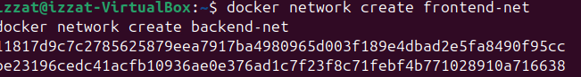

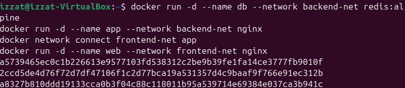

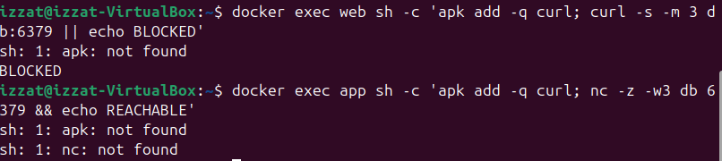

## Task 5 — Default-deny firewall

### Objective

Model a host firewall that denies incoming traffic by default and permits only HTTPS and loopback traffic.

### Procedure

The rules were applied inside a disposable Alpine container with the `NET_ADMIN` capability.

```bash
docker run --rm \
  --cap-add=NET_ADMIN \
  alpine sh -c '
    apk add --no-cache -q iptables
    iptables -P INPUT DROP
    iptables -A INPUT -p tcp --dport 443 -j ACCEPT
    iptables -A INPUT -i lo -j ACCEPT
    iptables -L INPUT -n --line-numbers
  '
```

### Result

```text
Chain INPUT (policy DROP)
num  target  prot  source     destination  options
1    ACCEPT  tcp   0.0.0.0/0  0.0.0.0/0    tcp dpt:443
2    ACCEPT  all   0.0.0.0/0  0.0.0.0/0
```

All inbound traffic is denied unless it matches an explicit allow rule. Port `443/tcp` is permitted, and loopback traffic is retained for local inter-process communication.

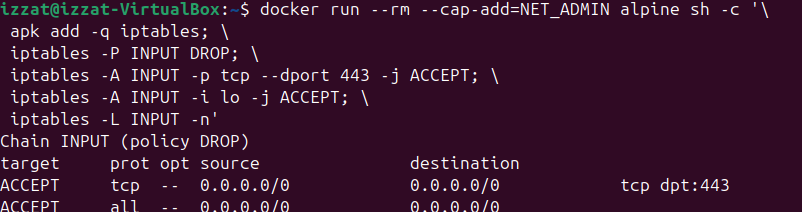

## Task 6 — Container hardening and vulnerability scanning

### Objective

Reduce the privileges and writable surface of a web container, verify the controls, and scan an image for high- and critical-severity vulnerabilities.

### Procedure

1. An unprivileged Nginx container was started with a numeric non-root identity, a read-only root filesystem, no Linux capabilities, no-new-privileges, and a temporary in-memory `/tmp` filesystem.

   ```bash
   docker run -d \
     --name hardened \
     --user 1000:1000 \
     --read-only \
     --cap-drop=ALL \
     --security-opt no-new-privileges \
     --tmpfs /tmp \
     nginxinc/nginx-unprivileged
   ```

2. The container status and logs were checked. Nginx started successfully; the expected read-only warning confirmed that modification of the default configuration was blocked.

3. The hardening configuration was verified.

   ```bash
   docker inspect hardened \
     --format 'User={{.Config.User}} ReadOnly={{.HostConfig.ReadonlyRootfs}}'

   docker inspect hardened \
     --format 'CapDrop={{json .HostConfig.CapDrop}}'

   docker inspect hardened \
     --format 'SecurityOptions={{json .HostConfig.SecurityOpt}}'
   ```

### Verification result

```text
User=1000:1000 ReadOnly=true
CapDrop=["ALL"]
SecurityOptions=["no-new-privileges"]
```

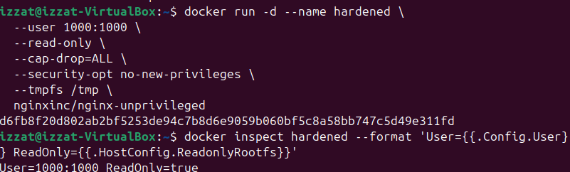

4. Trivy was run against the Alpine Nginx image, restricted to high- and critical-severity vulnerabilities.

   ```bash
   docker run --rm aquasec/trivy:latest \
     image \
     --scanners vuln \
     --severity HIGH,CRITICAL \
     nginx:alpine | tee trivy-scan.txt
   ```

### Scan result

```text
Target: nginx:alpine (alpine 3.24.1)
Type: alpine
HIGH/CRITICAL vulnerabilities: 0
```

The result means that Trivy found no high- or critical-severity operating-system package vulnerabilities in the scanned image and database at that time. It does not guarantee that the image has no vulnerabilities of lower severity or vulnerabilities unknown to the scanner.

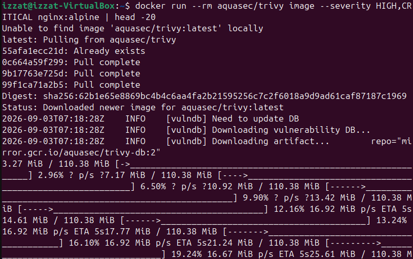

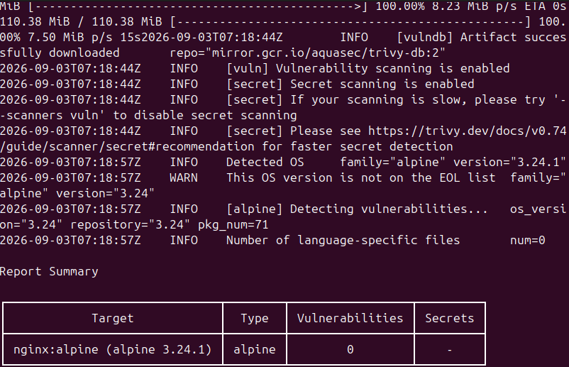

### Hardening measures and reduced attack surfaces

| Hardening measure | Evidence | Attack or exposure reduced |
|---|---|---|
| Run as `1000:1000` | `User=1000:1000` | Limits the impact of remote code execution by preventing the service from starting with root privileges. |
| Read-only root filesystem | `ReadOnly=true` | Blocks modification of application and system files, reducing malware persistence and tampering. |
| Drop all Linux capabilities | `CapDrop=["ALL"]` | Removes privileged kernel operations that could be abused for container escape, network manipulation, or host changes. |
| `no-new-privileges` | Inspect output | Prevents processes from acquiring additional privileges through set-user-ID binaries or file capabilities. |
| `tmpfs /tmp` | Run command | Provides required temporary storage without making the root filesystem writable; contents are non-persistent. |
| Alpine scan target | Trivy summary | Uses and checks a smaller package base, reducing the number of components that may contain known vulnerabilities. |

## Required verification commands

### Kubernetes role binding

```bash
kubectl get rolebinding dev-rb -n app -o yaml
```

The captured YAML identifies `dev-rb`, references `dev-role`, and binds the `dev` service account in the `app` namespace. This output is visible in the Task 3 RBAC evidence.

### Dropped container capabilities

```bash
docker inspect hardened --format '{{json .HostConfig.CapDrop}}'
```

```text
["ALL"]
```

This output is visible in the Task 6 inspect evidence.

## Short-answer questions

### Q1. Explain the difference between authentication and authorization using Tasks 1 and 3.

Authentication confirms an individual's identification. In Task 1, Nginx requested a login and password from the client; HTTP 401 was returned for invalid credentials, while HTTP 200 was returned for acceptable credentials. What an authenticated identity can accomplish is determined by authorisation. The dev service account was identified as an identity in Task 3, but only pod-reading actions were permitted due to its RBAC function. Pods could be listed, however deployments and pod deletions were not possible. As a result, authorisation comes after authentication, yet full access is not always granted after successful authentication.

### Q2. Why is MFA so effective, and which attacks does it defeat?

Independent evidence from many factor classes is necessary for MFA. Whereas the TOTP generator or authenticator is something the user owns, a password is something the user knows. Therefore, a password that has been stolen is not enough. Password guessing, credential stuffing, password reuse, brute-force password attacks, and several attacks based on compromised or phished credentials are all prevented by MFA. For higher-risk systems, phishing-resistant factors are preferred because TOTP is not a perfect defence against real-time adversary-in-the-middle phishing or MFA-fatigue tactics.

### Q3. How does network segmentation limit the damage of a compromised web server?

The database and the public-facing web tier are located on separate networks thanks to segmentation. Only `web` and `db` had access to frontend-net and backend-net, respectively, in this experiment; only `app` connected both. An attacker still lacks a clear network path to Redis even if they manage to breach the web server. This forces database access through the regulated application tier, restricts lateral movement, and decreases the reachable attack surface.

### Q4. What does a default-deny firewall policy achieve, and how does it relate to cloud security groups?

Unless a rule specifically allows it, a default-deny policy removes traffic. Only HTTPS on TCP port `443` and loopback traffic were permitted under the lab's `INPUT DROP` policy. This makes every allowed path intentional and lessens unintentional exposure. The same allow-list idea is applied by cloud security groups: incoming traffic is blocked unless an ingress rule specifically permits a protocol, port, and source.

### Q5. List the hardening measures applied and the attack surface each one removes.

Running as a non-root user, mounting the root filesystem read-only, and removing all Linux functionality were the fundamental steps. These constraints, in turn, eliminate access to privileged kernel activities, prevent filesystem tampering and persistence, and diminish privilege following service penetration. Additionally, the container employed a `tmpfs` mount for non-persistent temporary writes and `no-new-privileges` to prevent privilege increases. Lastly, Trivy was used to scan an Alpine-based Nginx image for known high- and critical-severity package vulnerabilities.

## Security best-practices checklist

- [x] Service requires authentication; unauthenticated requests are rejected.
- [x] MFA/second factor was generated and successfully validated.
- [x] RBAC enforces least privilege; unauthorized actions are denied.
- [x] Network segmentation prevents direct web-to-database communication.
- [x] Default-deny firewall uses explicit allow rules.
- [x] Container runs as non-root.
- [x] Container root filesystem is read-only.
- [x] Linux capabilities are dropped.
- [x] `no-new-privileges` is enabled.
- [x] Image was scanned for high- and critical-severity vulnerabilities.

## Cleanup and teardown

The lab resources were removed after evidence collection.

```bash
docker rm -f authsvc db app web hardened 2>/dev/null
docker network rm frontend-net backend-net 2>/dev/null
kind delete cluster --name ccse-lab4
```

The cleanup output shows removal of the remaining containers, both custom networks, and the `ccse-lab4` kind cluster. `authsvc` had already been stopped earlier and was automatically removed because it was started with `--rm`.

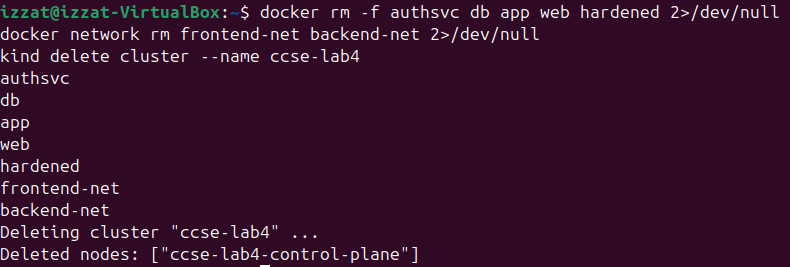

## Evidence completeness and issues found

All required deliverables from the guide are present:

| Guide requirement | Evidence | Status |
|---|---|---:|
| HTTP `401` without credentials and `200` with valid credentials | Task 1 authentication screenshot | Complete |
| Valid TOTP produces `MFA OK` | Task 2 screenshot | Complete |
| Three `kubectl auth can-i` results | Task 3 RBAC screenshot | Complete |
| `web -> db: BLOCKED` and `app -> db: REACHABLE` | Task 4 results screenshot | Complete |
| Default-deny iptables ruleset | Task 5 screenshot | Complete |
| Hardened-container inspect output | Task 6 inspect screenshot | Complete |
| Trivy scan summary | Task 6 Trivy summary screenshot | Complete |
| Role-binding YAML verification | Task 3 RBAC screenshot | Complete |
| Dropped-capabilities verification | Task 6 inspect screenshot | Complete |

### Missing or noteworthy items

- No required step, picture, or command output is missing.
- The workspace originally had no folder named `Evidence`; the 13 source screenshots were stored at the workspace root. This report creates and uses an `lab-images/lab4/` folder with clearly named copies.
- Task 2 contains an initial `MFA FAILED` result, followed by the required successful `MFA OK` result using a fresh code. No repeat screenshot is needed.
- Task 4 contains a duplicate `web` container-name warning. The following container list and the final connectivity tests confirm that the required container was already running, so no evidence is missing.
- The Trivy result is time-specific and covers only the requested `HIGH` and `CRITICAL` severities for `nginx:alpine`; it should not be interpreted as proof that no lower-severity or future vulnerability exists.

## Conclusion

Identity controls, authorisation, network controls, and workload hardening were all successfully integrated in the lab. Anonymous access was denied by password authentication; TOTP added a second factor; Kubernetes RBAC enforced least privilege; Docker segmentation prevented direct frontend-to-database access; the firewall automatically blocked traffic; and the hardened container operated non-root with a read-only filesystem, no additional features, and no privilege escalation. At the time of testing, the accompanying Trivy scan found no high- or critical-severity vulnerabilities in the analysed Alpine Nginx image.
