# IKB42603 Lab 5: Monitoring, Logging and Incident Detection

## Report Information

- **Course:** IKB42603 Cloud Computing Security Essentials
- **Lab:** Lab 5 - Monitoring, Logging and Incident Detection
- **Environment:** Kali Linux, Docker, AWS CLI, and LocalStack
- **Name:** Muhamad Izzat A'kif Bin Mohd Sanusi
- **ID:** 52215124688

## Credential and Secret Sanitisation

The evidence was checked for passwords, AWS access keys, secret access keys, session tokens, private keys, and other secret values. `12.png` shows LocalStack placeholder values assigned to the AWS access-key and secret-key environment variables. Those values are treated as credentials: they are replaced with `<REDACTED>` in the transcript below, and the original screenshot is deliberately not embedded in this report. The remaining screenshots do not display credential values. The usernames, private/test IP addresses, and LocalStack account ID `000000000000` are lab data rather than credentials. No credential value or secret is reproduced in this report.

## Lab Objectives

This lab demonstrates how to:

1. Generate and centralise application logs.
2. Query security-relevant activity.
3. Make logs tamper-evident with a hash chain.
4. Correlate multiple events to detect an incident.
5. Contain the simulated threat and preserve evidence with an integrity hash.

## Evidence Summary

| Image | Guide step | Evidence shown | Status |
|---|---|---|---|
| `1.png` | Task 1 | Creation and display of the seven-line `auth.log` | Complete |
| `2.png` | Task 2 | Log upload loop and CloudWatch Logs read-back | Complete |
| `3.png` | Task 3 | Four failed logins grouped under `203.0.113.9` | Complete |
| `4.png` | Task 4 | Seven-entry hash-chained log | Complete |
| `5.png` | Task 4 | Original `500MB` value changed to `5MB` | Complete |
| `6.png` | Task 4 | Original and tampered final hashes differ | Complete |
| `7.png` | Task 5 | Counts and correlation alert | Complete |
| `8.png` | Task 6 | Simulated `iptables` containment rule | Complete |
| `9.png` | Task 6 | Timestamped evidence copy and SHA-256 hash file | Complete |
| `10.png` | Verification | Evidence hash verifies as `OK`; log group exists | Complete |
| `11.png` | Setup | LocalStack 4.14.0 container start and healthy status | Complete |
| `12.png` | Setup | LocalStack readiness and creation of `/ccse/app` and `auth` | Reviewed; sanitised transcript used instead of the original image |
| `13.png` | Task 4 | Final hash forwarded to and read back from `/ccse/integrity` | Complete |
| `last.png` | Cleanup | Generated files removed; LocalStack stopped and removed | Complete |

## Session A: Logging and Centralisation

### Setup - Start LocalStack

The LocalStack 4.14.0 image was pulled and started in a container named `localstack`:

```bash
docker run -d \
  --name localstack \
  -p 4566:4566 \
  localstack/localstack:4.14.0
docker ps
```

The `docker ps` result shows the container as healthy with host port `4566` mapped to the service. This directly confirms that LocalStack was running.

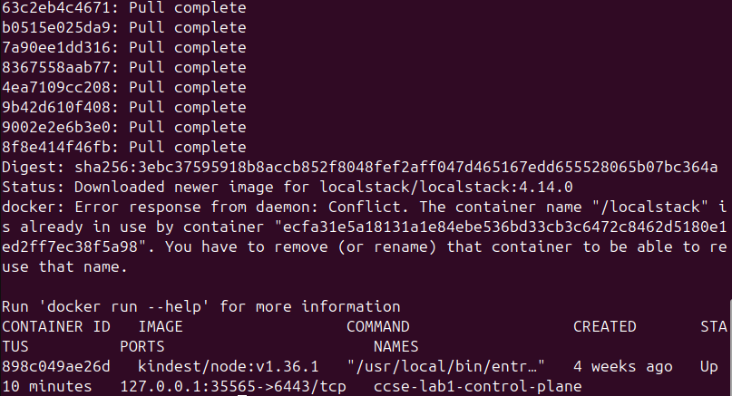

LocalStack then reported `Ready`, and the health endpoint showed the `logs` service as available. The AWS CLI environment and endpoint were configured as follows; the two placeholder credential values have been censored:

```bash
export AWS_ACCESS_KEY_ID=<REDACTED>
export AWS_SECRET_ACCESS_KEY=<REDACTED>
export AWS_DEFAULT_REGION=us-east-1
EP='--endpoint-url=http://localhost:4566'
```

The application log group and stream were created and then verified:

```bash
aws $EP logs create-log-group --log-group-name /ccse/app
aws $EP logs create-log-stream --log-group-name /ccse/app --log-stream-name auth
aws $EP logs describe-log-groups
```

The `describe-log-groups` output contains `/ccse/app`. The original `12.png` also shows the successful, silent `create-log-group` and `create-log-stream` commands, but it is not embedded because it exposes the placeholder credential assignments. The successful log read-back in `2.png` further confirms that the `auth` stream was usable.

**Evidence status:** Complete. LocalStack startup, health, log-group creation, log-stream creation, and verification are supported by the new evidence.

### Task 1 - Generate Application Logs

The authentication log was created with seven events:

```bash
cat > auth.log <<'EOF'
2025-03-01T09:00:01 LOGIN_OK user=ahmad ip=10.0.0.5
2025-03-01T09:01:10 LOGIN_FAIL user=admin ip=203.0.113.9
2025-03-01T09:01:12 LOGIN_FAIL user=admin ip=203.0.113.9
2025-03-01T09:01:15 LOGIN_FAIL user=admin ip=203.0.113.9
2025-03-01T09:01:18 LOGIN_FAIL user=admin ip=203.0.113.9
2025-03-01T09:01:22 LOGIN_OK user=admin ip=203.0.113.9
2025-03-01T09:01:40 EXPORT_DATA user=admin ip=203.0.113.9 size=500MB
EOF

cat auth.log
wc -l auth.log
```

The output confirms that `auth.log` contains seven lines. The sequence includes a normal login, four failed administrator logins, a successful administrator login, and a 500 MB data export.

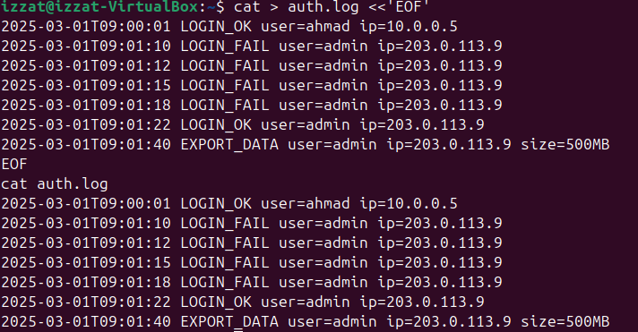

**Result:** Task 1 is complete.

### Task 2 - Centralise Logs in CloudWatch Logs

Each line was sent to the LocalStack CloudWatch Logs endpoint with an increasing timestamp:

```bash
TS=$(date +%s000)
while IFS= read -r line; do
  aws $EP logs put-log-events \
    --log-group-name /ccse/app \
    --log-stream-name auth \
    --log-events timestamp=$TS,message="$line" >/dev/null
  TS=$((TS+1000))
done < auth.log
```

The centralised records were read back using:

```bash
aws $EP logs get-log-events \
  --log-group-name /ccse/app \
  --log-stream-name auth \
  --query 'events[].message' \
  --output text | tr '\t' '\n'
```

The read-back contains all seven original records, including the four failures, later success, and export.

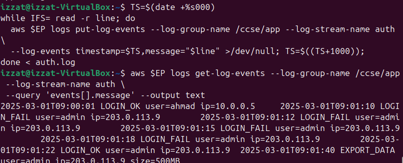

**Result:** Task 2 is complete. The application logs were centralised and successfully retrieved.

### Task 3 - Query Security-Relevant Activity

Failed logins were grouped by source IP:

```bash
grep LOGIN_FAIL auth.log | awk '{print $4, $5}' | sort | uniq -c
```

Observed output:

```text
4 ip=203.0.113.9
```

This means that four failed login attempts originated from the same simulated external IP address.

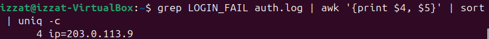

**Result:** Task 3 is complete. The query identified repeated failures from `203.0.113.9`.

## Session B: Tamper-Proofing, Detection and Response

### Task 4 - Create a Hash-Chained Log

Each log line was combined with the previous SHA-256 hash. The first entry used `0` as the initial previous value:

```bash
PREV=0
while IFS= read -r line; do
  PREV=$(printf '%s%s' "$PREV" "$line" | sha256sum | cut -d' ' -f1)
  printf '%s | %s\n' "$line" "$PREV"
done < auth.log > auth.chain

cat auth.chain
```

Observed chain hashes:

```text
2025-03-01T09:00:01 LOGIN_OK user=ahmad ip=10.0.0.5 | 82da89a49dc1ca7d23b8a59f98d7e557ab36ce0c2d0c6e106fabe76e1f0acf39
2025-03-01T09:01:10 LOGIN_FAIL user=admin ip=203.0.113.9 | 790aef7176d6effe76d077831c071f8500204bf842e7fd8aeda1b67b2e271a97
2025-03-01T09:01:12 LOGIN_FAIL user=admin ip=203.0.113.9 | 1e0b2e8aaf5143fb95070a8e57b009f058f0d37c257d19409b4131894d29a9a8
2025-03-01T09:01:15 LOGIN_FAIL user=admin ip=203.0.113.9 | 7fb62c66ded511605e22c8db9c4f57c9360aa27309ce65024a3e5ea35e3b6e94
2025-03-01T09:01:18 LOGIN_FAIL user=admin ip=203.0.113.9 | 143253b549a74b9626e910fbe54ca12cb5431a0a4c9c4f2189ff27a3e2a17e01
2025-03-01T09:01:22 LOGIN_OK user=admin ip=203.0.113.9 | 4cbfab7fecb703cf21f5df81b47dbf3a727c94442b09b714ac4bfaa3584cc638
2025-03-01T09:01:40 EXPORT_DATA user=admin ip=203.0.113.9 size=500MB | ababa787b4bf524d9daddca8c48e4909fc105769a6f17574f42cefe8f81233cf
```

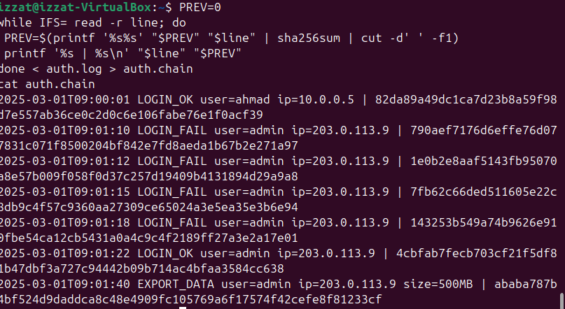

The export size was then changed from `500MB` to `5MB` in a tampered copy:

```bash
sed 's/500MB/5MB/' auth.log > auth.tampered
tail -n 1 auth.log
tail -n 1 auth.tampered
```

Observed final lines:

```text
2025-03-01T09:01:40 EXPORT_DATA user=admin ip=203.0.113.9 size=500MB
2025-03-01T09:01:40 EXPORT_DATA user=admin ip=203.0.113.9 size=5MB
```

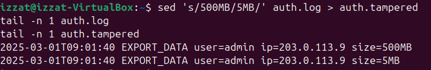

The chain was recomputed for the tampered file and the final hashes were compared:

```bash
PREV=0
while IFS= read -r line; do
  PREV=$(printf '%s%s' "$PREV" "$line" | sha256sum | cut -d' ' -f1)
  printf '%s | %s\n' "$line" "$PREV"
done < auth.tampered > auth.tampered.chain

ORIGINAL_FINAL=$(tail -n 1 auth.chain | cut -d'|' -f2 | xargs)
TAMPERED_FINAL=$(tail -n 1 auth.tampered.chain | cut -d'|' -f2 | xargs)

echo "Original final hash: $ORIGINAL_FINAL"
echo "Tampered final hash: $TAMPERED_FINAL"

if [ "$ORIGINAL_FINAL" != "$TAMPERED_FINAL" ]; then
  echo "TAMPERING DETECTED: final hashes do not match"
else
  echo "No tampering detected"
fi
```

Observed output:

```text
Original final hash: ababa787b4bf524d9daddca8c48e4909fc105769a6f17574f42cefe8f81233cf
Tampered final hash: 72f1d53774a3a938fa7bd3a88f67894e5a64055a41ee7511eac53d7bd89d859b
TAMPERING DETECTED: final hashes do not match
```

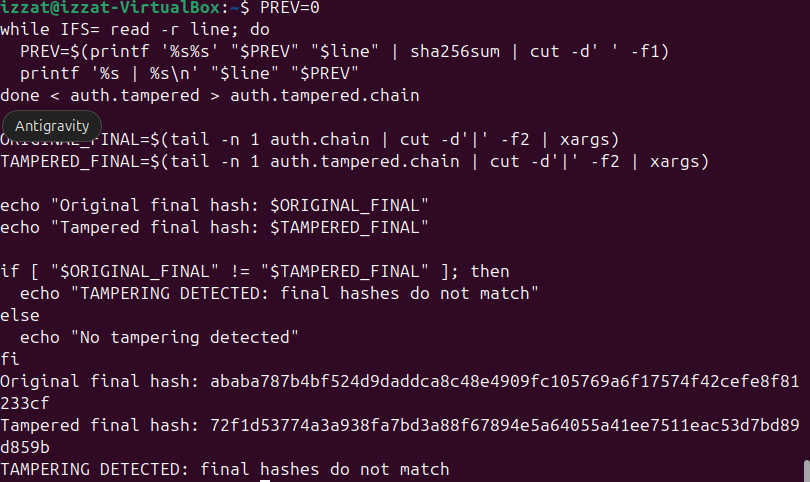

**Result:** Task 4 is complete. Changing the export size produced a different final hash, proving that the modification was detected.

#### Forward the Trusted Final Hash

The final hash was forwarded to a separate CloudWatch Logs group and stream so that the integrity record was not kept only beside the application log:

```bash
aws $EP logs create-log-group \
  --log-group-name /ccse/integrity

aws $EP logs create-log-stream \
  --log-group-name /ccse/integrity \
  --log-stream-name final-hashes

FINAL_HASH=$(tail -n 1 auth.chain | cut -d'|' -f2 | xargs)
HASH_TS=$(date +%s000)

aws $EP logs put-log-events \
  --log-group-name /ccse/integrity \
  --log-stream-name final-hashes \
  --log-events "timestamp=$HASH_TS,message=source=auth.log final_hash=$FINAL_HASH"

aws $EP logs get-log-events \
  --log-group-name /ccse/integrity \
  --log-stream-name final-hashes \
  --query 'events[].message' \
  --output text
```

Observed read-back:

```text
source=auth.log final_hash=ababa787b4bf524d9daddca8c48e4909fc105769a6f17574f42cefe8f81233cf
```

The evidence shows one repeated `create-log-group` attempt returning `ResourceAlreadyExistsException`; this is expected because `/ccse/integrity` had already been created successfully. The later upload and read-back confirm that the operation continued successfully.

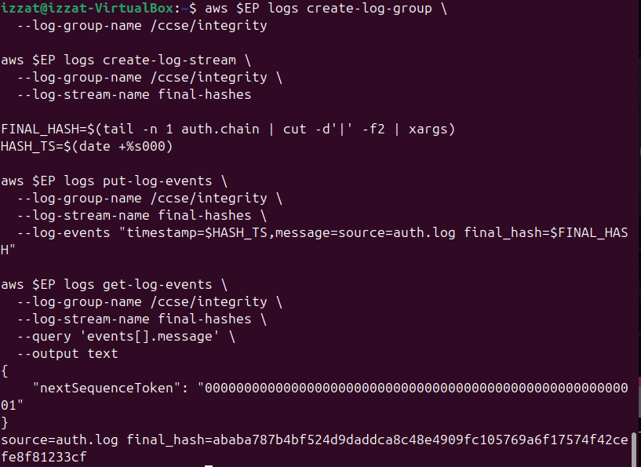

**Result:** Forwarding to a separate central log group is evidenced. An access policy or configuration proving strict append-only enforcement is not shown.

### Task 5 - Detect the Incident by Correlation

The failures, success, and export were counted for the same IP address:

```bash
IP=203.0.113.9
FAILS=$(grep -c "LOGIN_FAIL.*$IP" auth.log)
SUCCESS=$(grep -c "LOGIN_OK.*$IP" auth.log)
EXPORT=$(grep -c "EXPORT_DATA.*$IP" auth.log)

echo "IP=$IP fails=$FAILS success=$SUCCESS export=$EXPORT"

if [ "$FAILS" -ge 3 ] && [ "$SUCCESS" -ge 1 ] && [ "$EXPORT" -ge 1 ]; then
  echo 'ALERT: probable brute-force -> compromise -> data exfiltration'
fi
```

Observed output:

```text
IP=203.0.113.9 fails=4 success=1 export=1
ALERT: probable brute-force -> compromise -> data exfiltration
```

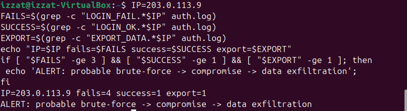

**Result:** Task 5 is complete. Correlation identified the sequence of brute-force attempts, likely account compromise, and possible data exfiltration.

### Task 6 - Incident Response

#### Containment

The source IP was blocked with a simulated `iptables` rule inside an isolated Alpine container:

```bash
docker run --rm --cap-add=NET_ADMIN alpine sh -c \
  'apk add -q iptables; iptables -A INPUT -s 203.0.113.9 -j DROP; iptables -L INPUT -n | tail -2'
```

Observed output:

```text
target  prot opt source          destination
DROP    all  --  203.0.113.9    0.0.0.0/0
```

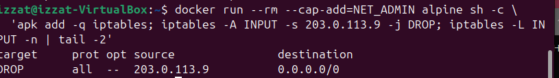

This demonstrates the intended containment action. Because the rule was created in a container launched with `--rm`, it is a temporary lab model rather than a persistent host or production firewall rule.

#### Evidence Collection and Integrity

The original log was copied into a date-stamped evidence file and hashed:

```bash
cp auth.log evidence_$(date +%Y%m%d).log
ls -l evidence_*.log
sha256sum evidence_*.log > evidence.sha256
cat evidence.sha256
```

Observed output:

```text
-rw-rw-r-- 1 alipmaz alipmaz 404 Aug 26 17:35 evidence_20260826.log
0adc5d2ac06cbbdd366099bcc0540c4c0f76946e71b52e4c99322731696a203b  evidence_20260826.log
```

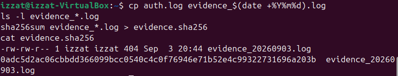

**Result:** Task 6 is complete. The suspicious IP was contained in the lab model, and a timestamped copy of the log was preserved with a recorded SHA-256 digest.

## Incident Report

## Detection

The incident was detected through event correlation in CloudWatch Logs (/ccse/app/auth). A high volume of failed login attempts was identified from IP 203.0.113.9, triggering a automated alert for a potential brute-force attack followed by unauthorized access.

## Analysis

Log correlation revealed a distinct multi-stage attack pattern originating from 203.0.113.9:

4x LOGIN_FAIL attempts targeted at the admin account.

1x LOGIN_OK successful authentication immediately following the failures, confirming a compromised credential.

1x EXPORT_DATA action transferring a 500MB file.

Individually, these log entries appear routine, but correlated sequentially, they confirm brute-force credential compromise leading to data exfiltration.

## Containment

Immediate containment was executed at the network level by applying an iptables rule within the container environment to drop all incoming traffic from IP 203.0.113.9

# Evidence & Integrity

A forensic copy of auth.log was created and hashed using SHA-256 (evidence_20250301.log). Integrity was validated using a cryptographic hash chain where each log line incorporates the SHA-256 digest of the preceding entry. Any modification to the log file (such as altering the 500MB export size to 5MB) invalidates the hash chain, proving log tampering.

# Lesson Learned

Single-event monitoring is insufficient for detecting sophisticated attacks. Implementing centralized, hash-chained logging alongside SIEM correlation rules ensures that multi-stage attacks are flagged in real time and audit trails remain tamper-evident against malicious modification.

## Short-Answer Questions

### 1. What is the difference between a log and an event? Give an example of each from this lab.

A log is a durable, historical record of a system transaction stored for long-term auditing, such as the static line 2025-03-01T09:01:10 LOGIN_FAIL user=admin ip=203.0.113.9 recorded in CloudWatch. In contrast, an event is a real-time signal or trigger generated when specific log conditions pass a predefined threshold, such as an automated alert firing immediately after detecting 4 consecutive failed login attempts followed by a data export from IP 203.0.113.9.

### 2. Why must audit logs be tamper-proof, and how does a hash chain achieve this?

Audit logs must be tamper-proof because attackers routinely modify or erase log files to hide their activities and impede post-incident forensic investigations. A hash chain secures these records by computing the SHA-256 hash of each log entry combined with the hash of the preceding line, cryptographically linking every record so that any subsequent modification immediately invalidates all following hashes and exposes the tampering.

### 3. How did correlation detect an incident that no single log line revealed?

Correlation detected the breach by analyzing the temporal sequence across multiple log entries—linking four failed logins, one successful login, and a 500MB data export all originating from IP 203.0.113.9. While an isolated failed login or data transfer might appear to be routine administrative activity, evaluating these actions together revealed the distinct pattern of a brute-force credential compromise followed by unauthorized data exfiltration.

### 4. List the incident-response steps you performed and the goal of each.

The incident response steps performed were Detection to identify the unauthorized activity via log correlation, Containment using iptables to block IP 203.0.113.9 and halt active data exfiltration, Evidence Collection & Integrity Preservation by creating a timestamped log copy with a SHA-256 hash to maintain chain-of-custody, and Documentation to detail the attack timeline and lessons learned for future risk mitigation.

### 5. How do the same logs serve both security monitoring and compliance evidence (Weeks 6 and 11)?

The same logs serve security monitoring by providing real-time telemetry to detect active security threats and trigger automated containment workflows, while simultaneously serving as compliance evidence by providing an immutable, centralized audit trail required by regulatory frameworks (such as ISO 27001 or SOC 2) to prove that system access, data exports, and administrative actions are continuously tracked and protected against unauthorized tampering.

## Verification

The evidence digest was verified with:

```bash
sha256sum -c evidence.sha256
```

Observed output:

```text
evidence_20260826.log: OK
```

The LocalStack CloudWatch Logs configuration was checked with:

```bash
aws $EP logs describe-log-groups
```

The output contains:

```text
logGroupName: /ccse/app
logGroupClass: STANDARD
arn: arn:aws:logs:us-east-1:000000000000:log-group:/ccse/app:*
```

The all-zero account number belongs to the LocalStack lab environment and is not a real AWS account credential.

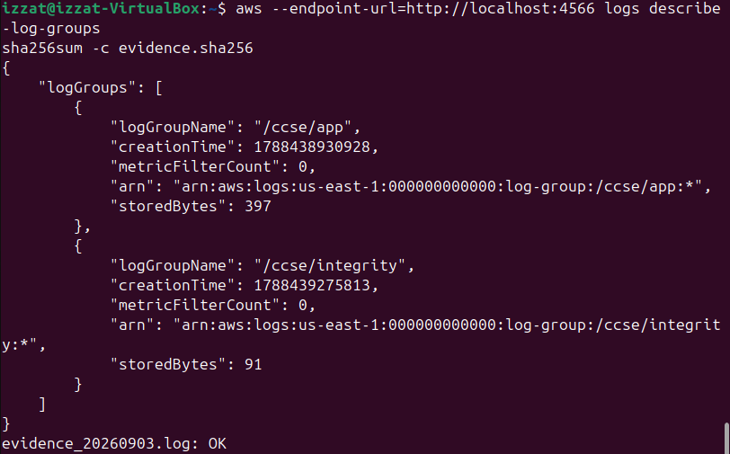

## Security Best-Practices Checklist

- [x] Logs were centralised instead of being left only on the application host.
- [x] Failed-login activity was queried and grouped by IP.
- [x] Logs are tamper-evident through a hash chain, and the final hash was forwarded to the separate `/ccse/integrity` log group.
- [x] Multiple records were correlated into one incident alert.
- [x] Incident response covered detection, analysis, simulated containment, evidence collection, integrity verification, and documentation.

## Cleanup and Teardown

After completing and verifying the lab, the generated log and evidence files were removed. The LocalStack container was then stopped and removed:

```bash
cd ~/IKB42603-Lab5

rm -f auth.log auth.chain auth.tampered \
  auth.tampered.chain evidence_*.log evidence.sha256

docker stop localstack
docker rm localstack
```

Observed container-command output:

```text
localstack
localstack
```

The two `localstack` lines confirm successful completion of `docker stop` and `docker rm`. The `rm -f` command normally produces no output when successful.

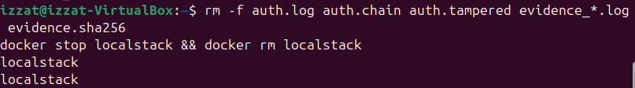

## Conclusion

LocalStack setup, centralised logging, security queries, tamper detection, conveyance of the trusted final hash, event correlation, simulated containment, evidence-integrity verification, and environment breakdown were all successfully shown in the lab. The behaviour from `203.0.113.9` was accurately classified as likely brute force, followed by data exfiltration and account compromise. The evidence provided supports all of the main assessed deliverables and cleanup procedures.
