## Course Information
---
*Course:* IKB42603 Cloud Computing Security Essentials

*Lab:* Lab 6

*Name:* MUHAMAD IZZAT A'KIF BIN MOHD SANUSI

*Date:* 11 SEPTEMBER 2026

*ID:* 52215124688

# IKB42603 Lab 6: Object Storage & Data Lifecycle

## Session A (Week 11) — Object Storage & the Exposure Problem

### One-Time Environment Setup
Start a clean, activated LocalStack instance and set up the environment with `ENFORCE_IAM=1` to ensure IAM policies are properly evaluated.

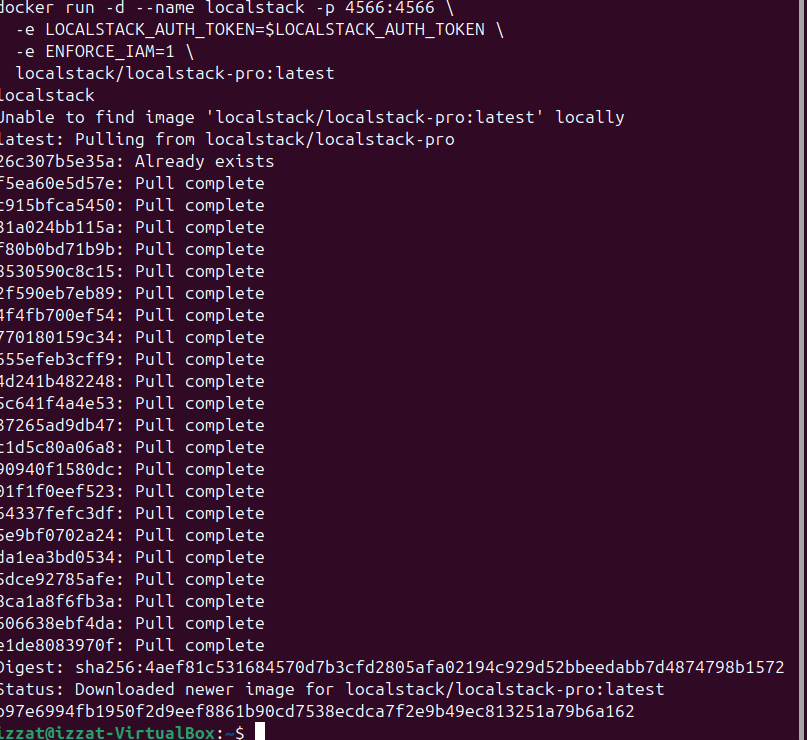

Point the AWS CLI at the LocalStack endpoint so all commands interact with our local environment.

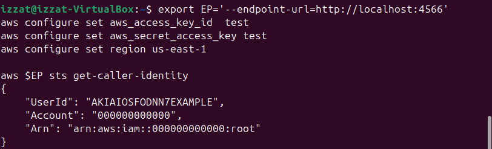

### Task 1 — Classify the Data Before You Store It
Security decisions should always follow data classification. We begin by creating an S3 bucket for a hospital records system and preparing three text objects of varying sensitivity (`public`, `internal`, and `confidential`).

Upload the objects to the bucket and tag each with its proper classification to establish a foundation for applying granular security controls later.

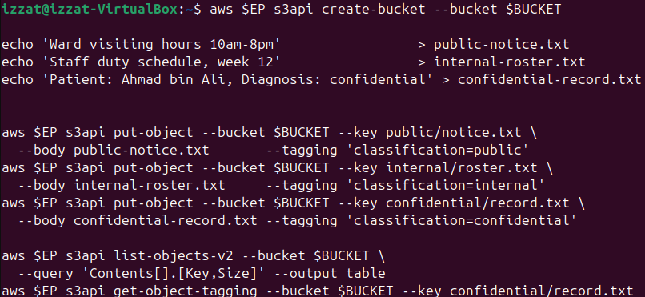

List the objects in the bucket to verify they have been successfully stored.

Retrieve the object tags to confirm the `confidential` classification tag is properly applied.

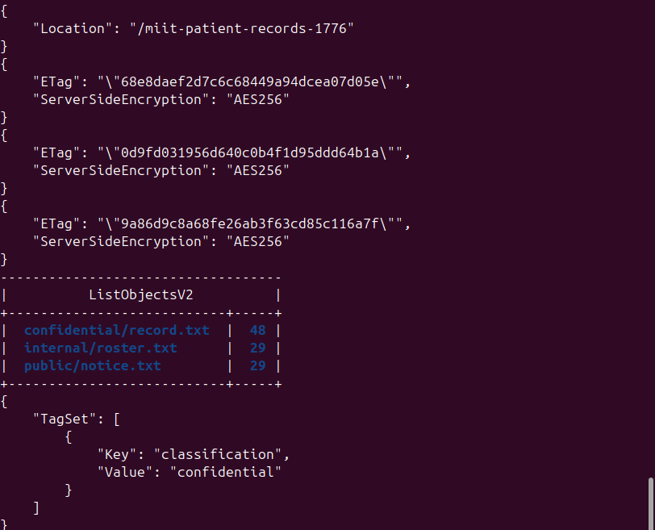

### Task 2 — Reproduce the Archetypal Breach
The most common cause of cloud data leaks is an overly permissive bucket policy. We deliberately reproduce this vulnerability by applying a bucket policy with `"Principal": "*"`, which exposes the bucket to the entire internet.

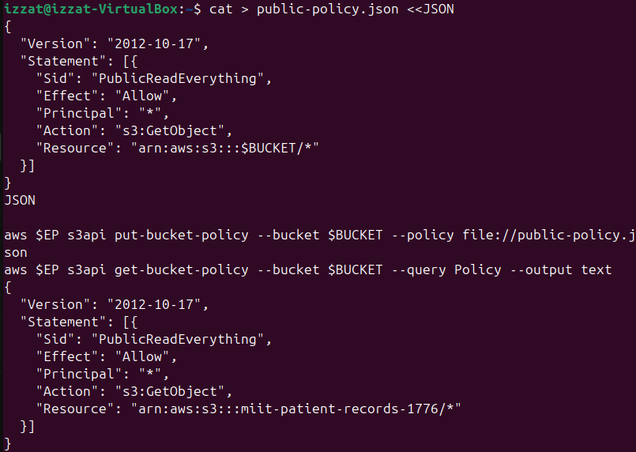

We confirm the breach by anonymously fetching the `confidential` record via a simple `curl` request, proving the data is exposed without any AWS credentials.

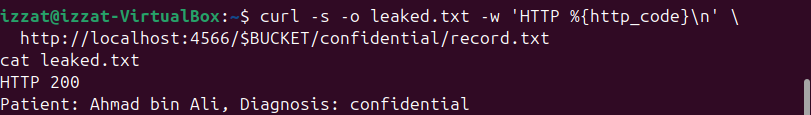

### Task 3 — Remediate with Block Public Access
To fix the exposure, we first delete the offending public policy. and To prevent this from happening again in the future, we apply an account-level guardrail called **Block Public Access**. This feature blocks any future attempts to apply public policies or ACLs.

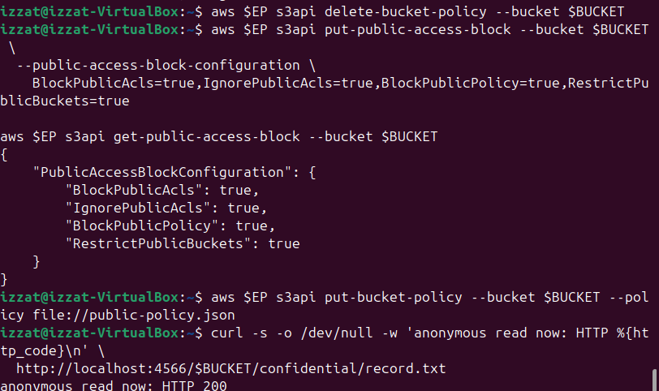

We test the guardrail by attempting to re-introduce the public policy. The guardrail actively refuses the operation.

We re-test the anonymous read request via `curl` to ensure the bucket is no longer publicly accessible.

Finally, we replace the policy with a least-privilege approach, restricting read access strictly to our own account and scoped only to the `internal/` prefix.

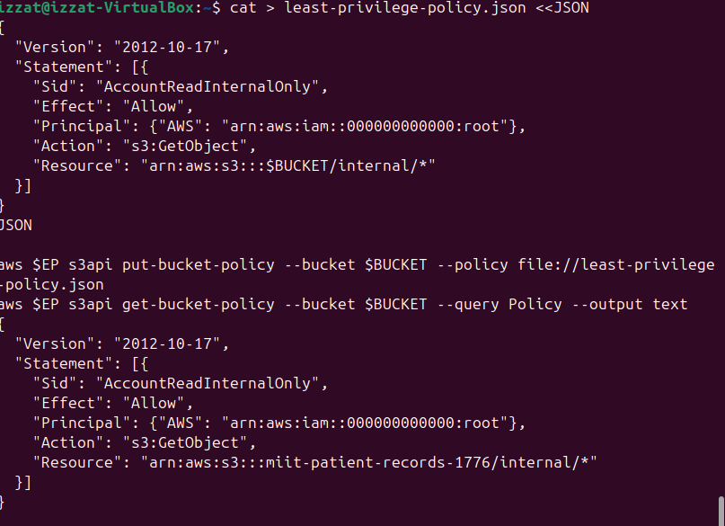

### Task 4 — Identity Policy vs Resource Policy
We create an IAM user ("DataAnalyst") whose policy allows reading everything across S3.

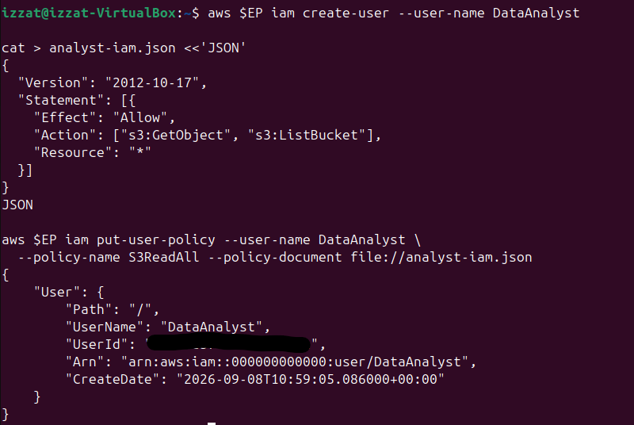

We note both the Access Key and Secret Key for the new user so we can test access.

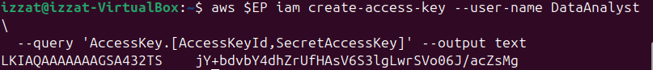

We copy the two values into our variables to configure a named AWS CLI profile for the analyst.

We add a bucket policy that explicitly denies the analyst access to the `confidential/` prefix, creating a disagreement between the Identity Policy (Allow) and Resource Policy (Deny).

The analyst attempts to read the `internal/` record. This succeeds because it is allowed by the Identity Policy and not denied by the Resource Policy.

The analyst attempts to read the `confidential/` record. This fails because an explicit `Deny` in the Resource Policy always overrides the `Allow` in the Identity Policy.

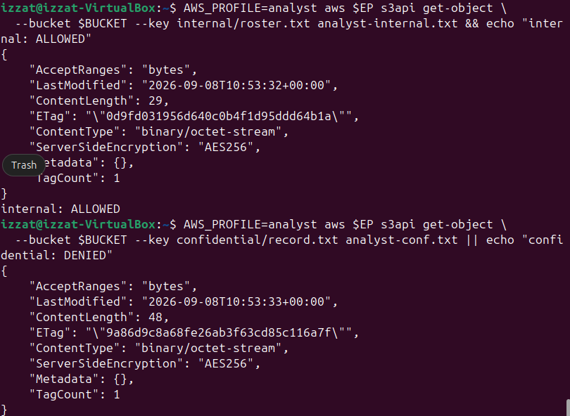

## Session B (Week 12) — Protecting, Retaining and Retiring Data

### Task 5 — Default Encryption at Rest (SSE-KMS)
We create a dedicated customer-managed KMS key for the bucket and configure default Server-Side Encryption (SSE-KMS) for the bucket using this key.

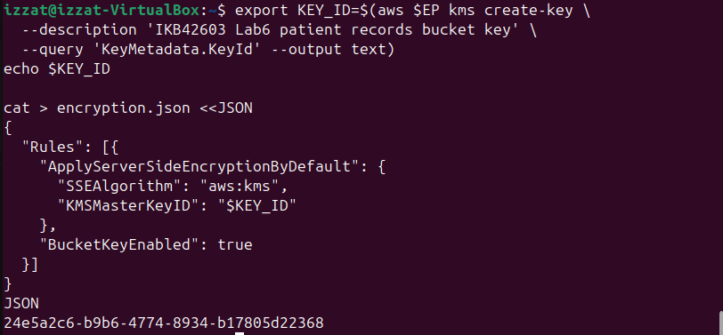

We upload a new record with NO explicit encryption flags. The bucket automatically encrypts it using the default KMS key, guaranteeing data protection at rest.

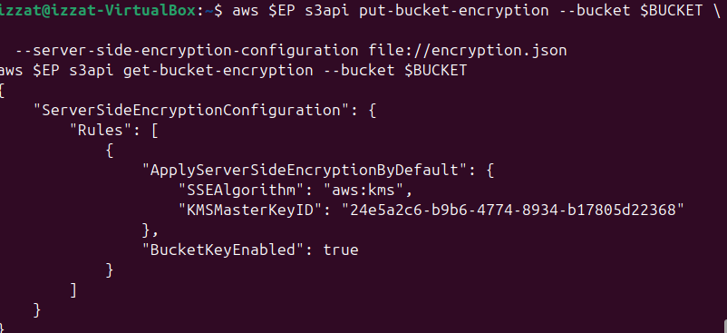

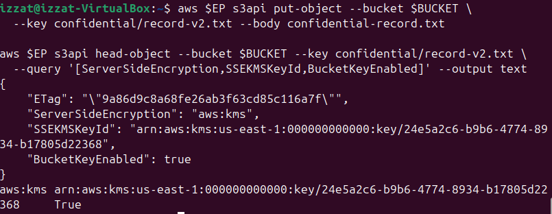

### Task 6 — Delegated Access and the Condition-Key Trap
We generate a **Presigned URL** to grant time-bounded, signed, single-object access to someone without AWS credentials.

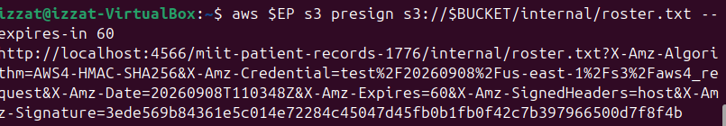

We paste the URL into a variable and successfully fetch the record using `curl`.

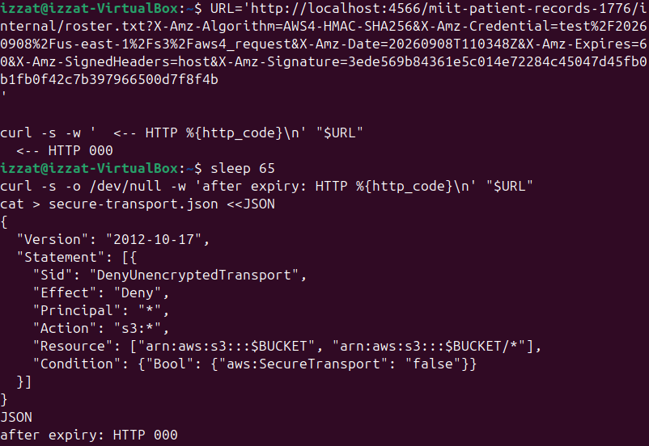

We wait for the pre-signed URL to lapse (expire), then try the exact same URL again. It correctly denies access.

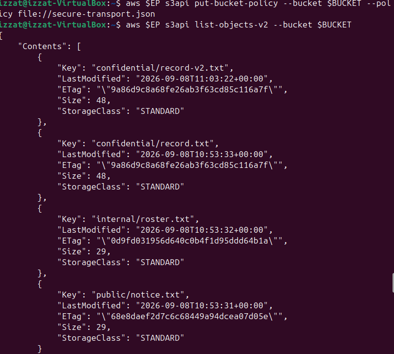

We apply a bucket policy condition (`aws:SecureTransport`) that enforces TLS (HTTPS). Any ordinary call over HTTP (which LocalStack uses locally) is now refused, trapping our requests.

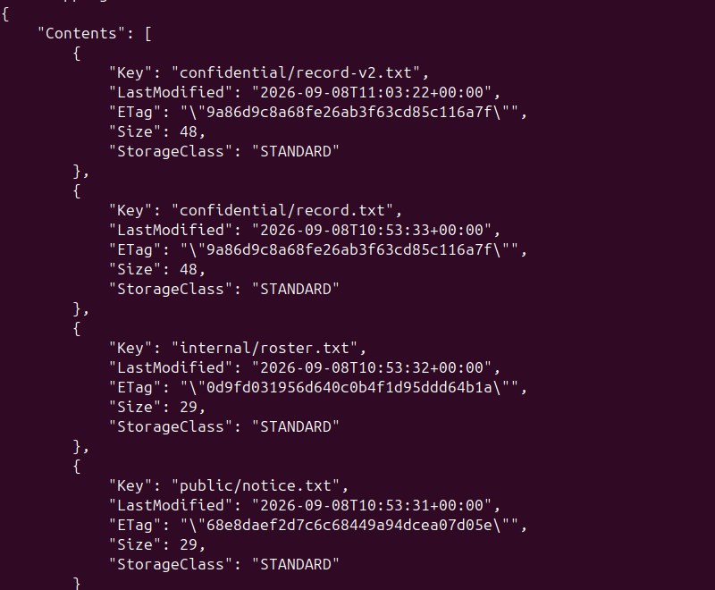

We recover by deleting the bucket policy before continuing with the rest of the lab.

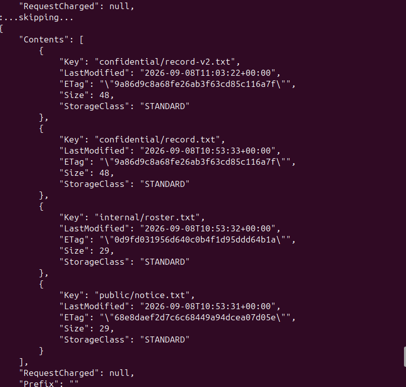

### Task 7 — Versioning, Delete Markers & Data Remanence
We enable bucket versioning. To an ordinary reader, deleting an object just hides it, but earlier tasks showed remanence inside a container volume. Object storage has its own version of this.

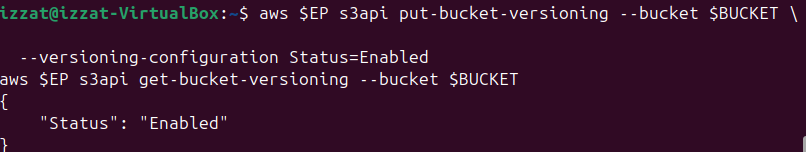

We upload two more revisions of the same confidential record.

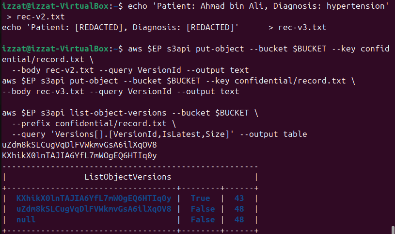

We "delete" the record using the standard delete command.

Because versioning is enabled, a delete marker is placed on top and is now the current version.

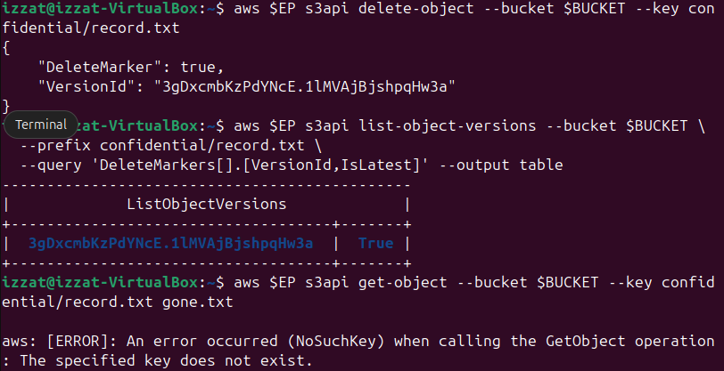

To an ordinary reader, the object appears to be completely gone.

However, if we query the specific older version ID, the original, unredacted record is still there (data remanence).

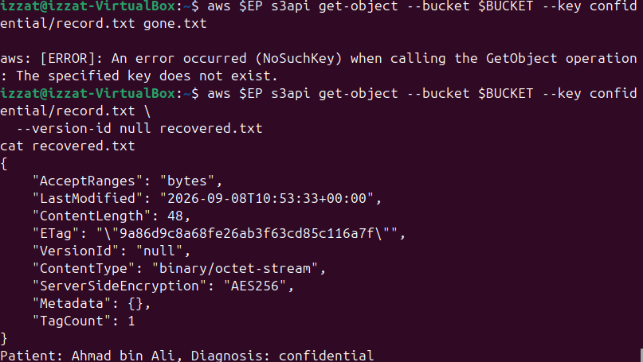

To comply with privacy laws, we must perform a permanent, per-version deletion by specifying the version ID explicitly.

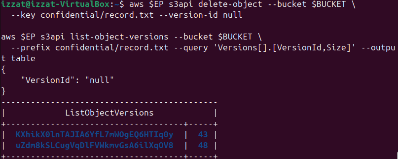

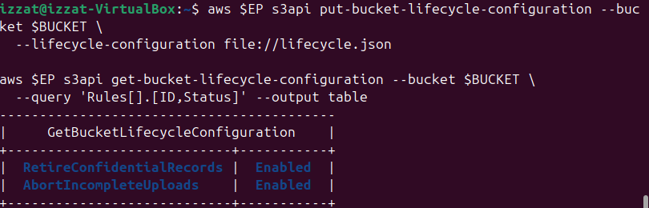

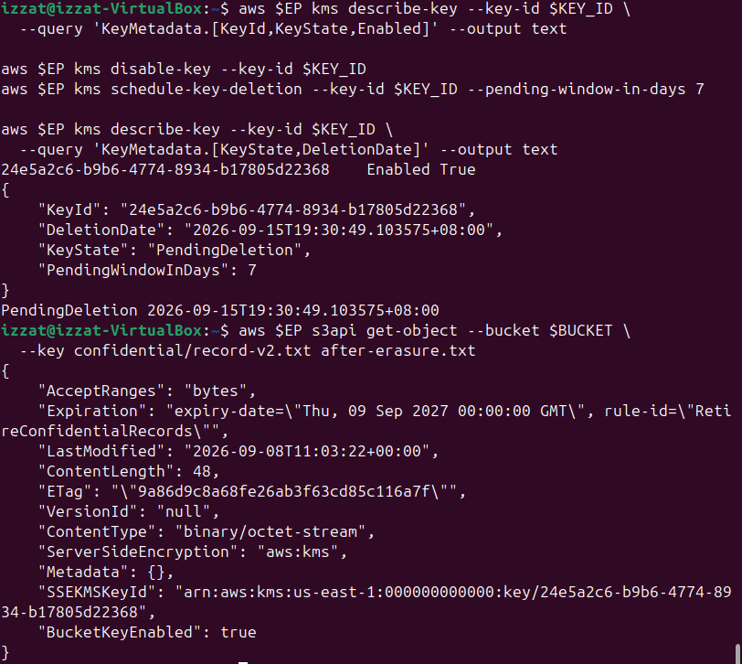

### Verification
We run the final verification commands to output the bucket's final security posture as requested by the auditor.

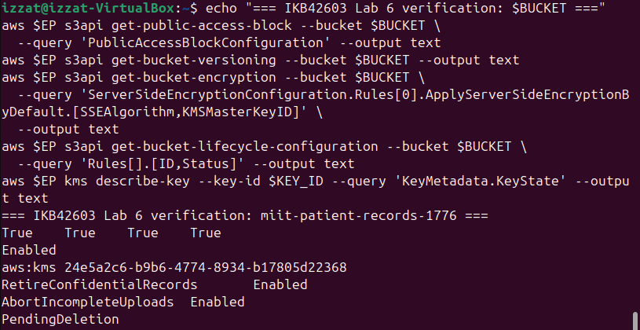

### Cleanup & Teardown
To fully delete a versioned bucket, we cannot use a simple force delete. We must first list and remove every object version and delete marker explicitly before the bucket becomes empty and can be destroyed.

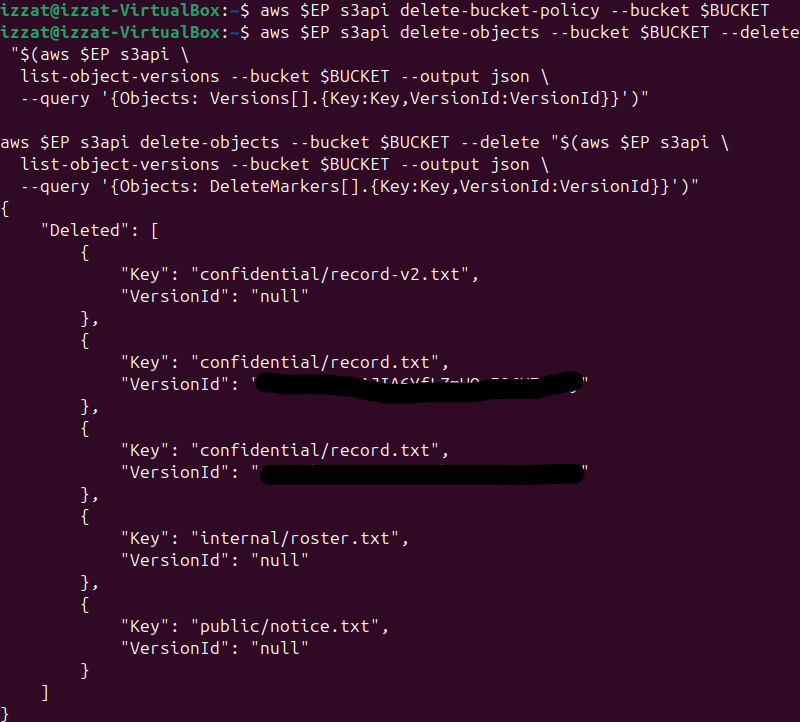

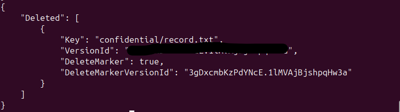

---

## Deliverables & Assessment

### 2. Data Classification Table
| Classification | Who may read it | Impact if leaked | Control you will apply |
|---|---|---|---|
| public | Anyone / Public | Low / None | Block Public Access (Guardrail) |
| internal | Internal Staff | Medium | Resource-based Policy (Least Privilege) |
| confidential | Specific Authorized Personnel | High / Critical | Default Encryption (SSE-KMS), Versioning & Lifecycle Management |

### 3. Short-Answer Questions

**Q: Which single element of the Task 2 policy caused the exposure, and why is Principal: "*" more dangerous on a bucket policy than an over-broad IAM policy attached to one user?**
"Principal" was the only ingredient that resulted in the exposure. Because it allows anyone on the internet, including entirely anonymous users without AWS credentials, to see a bucket policy, it is extremely risky. Only the particular authorised user to whom it is tied can access a too expansive IAM policy.

**Q: Explain the difference between an identity-based policy and a resource-based policy. In Task 4, which one decided each of the analyst's two requests?**
An IAM identity user or role is linked to an identity-based policy that specifies their capabilities. A resource-based policy specifies who can access a resource (such as an S3 bucket). In Task 4, the identity-based policy was the main factor that assessed and approved the read request for `internal`. The resource-based policy specifically rejected the read request for "confidential," superseding the identity-based allow.

**Q: Block Public Access is described as a guardrail rather than a control. What is the difference, and why does the distinction matter for an organisation with many engineers?**
Access is expressly granted or denied by a control (such as an IAM policy). Strict boundaries that take precedence over dangerous configurations are enforced by a guardrail, which functions globally at a higher level. A guardrail, which serves as a fail-safe mechanism against misconfigurations, guarantees that even if a developer makes a mistake and tries to apply a public bucket policy, it will be instantly blocked for an organization with a large number of engineers.

**Q: Your bucket has default SSE-KMS encryption. Does that protect the confidential record from the analyst in Task 4? Explain precisely what server-side encryption does and does not defend against.**
If the analyst has IAM access to read the S3 object and use the KMS key, then SSE-KMS does not safeguard the record. Server-side encryption permits cryptographic erasure and protects against unwanted access to the underlying physical storage medium (for example, in the event that hard drives are compromised). If a user is given the necessary logical permissions, it does not protect against unauthorised access at the application/API layer.

**Q: A patient invokes their right to erasure. Using your Task 7 evidence, explain why delete-object alone is not compliant, and describe two mechanisms that would make the deletion provable.**
When versioning is enabled, `remove-object` by itself only creates a delete marker while keeping the original data below (data remanence), meaning the data is not truly deleted. There are two methods for verifiable deletion:
1. Permanent per-version deletion: The delete request must specifically include the version-id.
2. Cryptographic erasure: Removing the data-protecting KMS encryption key, making all versions unrecoverable.

**Q: You are the auditor in Week 11. Name three commands from this lab whose output you would collect as compliance evidence, and state which control each one evidences.**
**A:**
1. `aws s3api get-public-access-block` - Evidences the guardrail control preventing public exposure.
2. `aws s3api get-bucket-encryption` - Evidences the control for default encryption at rest.
3. `aws s3api get-bucket-lifecycle-configuration` - Evidences the control for automated data retention/retirement policies.
